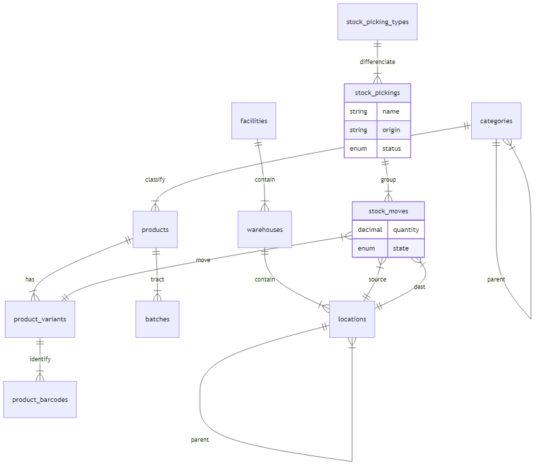
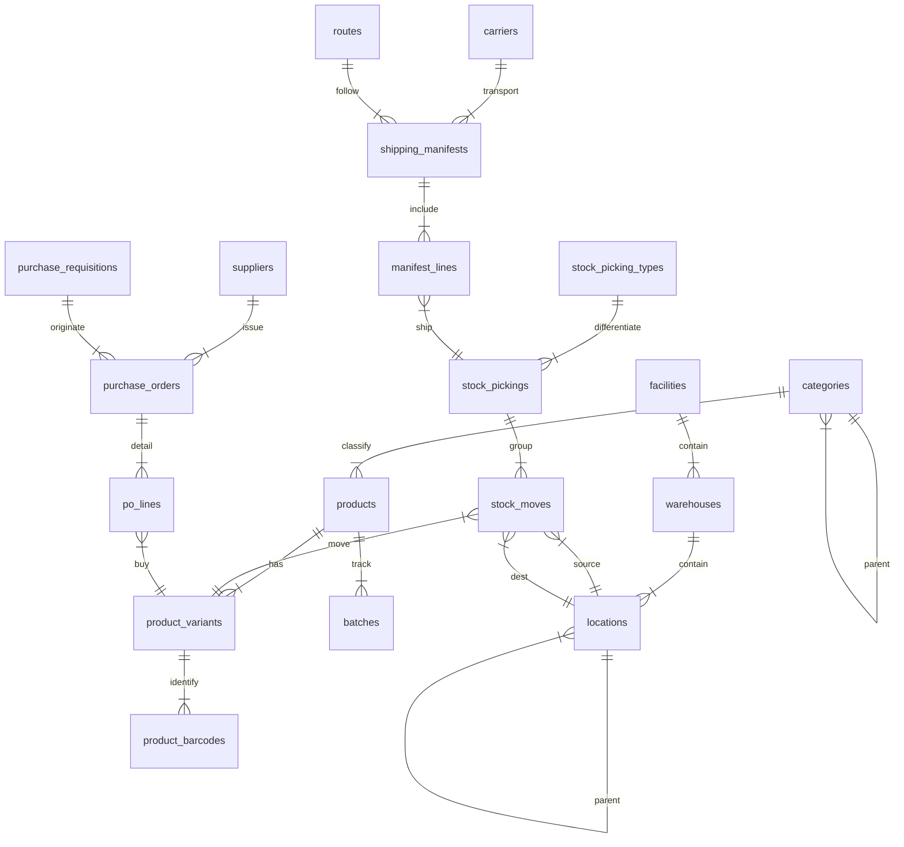

# Diseño de Base de Datos - Módulo de Inventario

Este documento detalla la estructura de la base de datos para el módulo de Gestión de Inventario del ERP. El diseño está orientado a ser modular, escalable (soporte para grandes volúmenes) y robusto (integridad de datos).

## 1. Clasificación y Catálogo de Productos (Core)

El corazón del sistema. Define *qué* estamos gestionando.

### 1.1 Tabla: `categories` (Categorías de Productos)
Permite organizar los productos jerárquicamente (ej: Electrónica -> Computadoras -> Laptops).

| Campo | Tipo | Restricciones | Descripción |
| :--- | :--- | :--- | :--- |
| `id` | INT / BIGINT | PK, Auto-incr | Identificador único de la categoría. |
| `parent_id` | INT / BIGINT | FK -> `categories.id`, Nullable | Referencia a la categoría padre. El sistema debe soportar árbol infinito. |
| `name` | VARCHAR(100) | Not Null | Nombre legible de la categoría. |
| `slug` | VARCHAR(120) | Unique, Index | Identificador amigable para URL o integración. |
| `is_active` | BOOLEAN | Default TRUE | "Soft delete". |
| `created_at` | TIMESTAMP | Default NOW() | Auditoría de creación. |

### 1.2 Tabla: `products` (Producto Maestro / Template)
Representa el concepto genérico (ej: "Camiseta Nike Polo"). No se inventaria directamente.

| Campo | Tipo | Restricciones | Descripción |
| :--- | :--- | :--- | :--- |
| `id` | INT / BIGINT | PK, Auto-incr | ID del maestro. |
| `category_id` | INT | FK -> `categories.id` | Clasificación. |
| `name` | VARCHAR(255) | Not Null | Nombre comercial (ej: "Camiseta Polo"). |
| `brand` | VARCHAR(100) | Index, Nullable | **Marca** (ej: "Nike", "Sony"). Agregado por solicitud. |
| `model` | VARCHAR(100) | Index, Nullable | **Modelo** (ej: "Air Max", "PlayStation 5"). |
| `description` | TEXT | Nullable | Descripción general. |
| `product_type` | VARCHAR | Default 'STOCKED' | 'STOCKED' (Almacenable), 'CONSUMABLE', 'SERVICE'. |
| `uom_base` | VARCHAR | Default 'PZA' | Unidad de Medida Base (ej: PZA, KG, M). |
| `has_variants` | BOOLEAN | Default FALSE | Indica si este producto se desglosa en variantes (SKUs). |
| `image_main` | VARCHAR | Nullable | **[NUEVO]** URL de la imagen principal. |
| `datasheet` | VARCHAR | Nullable | **[NUEVO]** URL del documento PDF/Técnico. |
| `is_active` | BOOLEAN | Default TRUE | . |

### 1.2.1 Tabla: `product_variants` (SKUs Físicos / La Realidad)
Aquí se genera el crecimiento, pero mantiene la tabla `products` limpia. **El inventario se relaciona con ESTA tabla.**

| Campo | Tipo | Restricciones | Descripción |
| :--- | :--- | :--- | :--- |
| `id` | INT / BIGINT | PK, Auto-incr | **ID real del ítem**. Usado en movimientos de stock. |
| `product_id` | INT | FK -> `products.id` | Relación con el padre. |
| `sku` | VARCHAR(50) | Unique, Not Null | SKU específico (ej: "NK-POLO-RED-M"). |
| `currency_id` | INT | FK -> `core.currencies.id` | **[NUEVO]** Moneda base del costo/precio. Si es NULL, usa la de la compañía. |
| `attributes` | JSONB / JSON | Nullable | La magia de la flexibilidad. Ej: `{"talla": "M", "color": "Rojo", "tela": "Algodón"}`. Permite N atributos sin crear N columnas. |
| `barcode` | VARCHAR(50) | Index | Código de barras principal de esta variable. |
| `costing_method` | ENUM | Default 'AVERAGE' | Generalmente se hereda, pero puede ser específico. |
| `standard_cost` | DECIMAL | Default 0 | **Costo Estándar**. Costo fijo administrativo/contable. |
| `average_cost` | DECIMAL | Default 0 | **Costo Promedio**. Se calcula por variante. |
| `last_cost` | DECIMAL | Default 0 | **Último Costo de Compra**. Específico de esta variante. |
| `replacement_cost` | DECIMAL | Default 0 | **Costo de Reposición**. Informado por proveedor para esta variante. |
| `sales_price` | DECIMAL | Default 0 | **[NUEVO] Precio de Venta**. Base para listas de precios o App. |
| `part_number` | VARCHAR(100) | Index, Nullable | **[NUEVO] Nro. Parte Fabricante**. Ej: "BOSCH-1234". Repuestos. |
| `image` | VARCHAR | Nullable | **[NUEVO]** Imagen específica de la variante (ej: zapato rojo). |
| `is_published` | BOOLEAN | Default FALSE | **[NUEVO]** Visible en App/Catálogo. |
| `weight` | DECIMAL | Nullable | Peso específico de la variante. |

**Beneficio de este modelo:**
*   **Catálogo Limpio**: Si tienes 1,000 modelos y 50,000 variantes, tu tabla `products` solo tiene 1,000 registros (rápido para buscar por nombre).
*   **Flexibilidad**: Usando una columna `JSON` para atributos, no necesitas alterar la base de datos si mañana vendes "Laptops" con atributos "RAM" y "Disco".
*   **Gestión**: El inventario (tabla `inventory_movements`) apuntará a `product_variants.id`. 

---

### 1.3 Tabla: `product_barcodes` (Presentaciones y Empaques)
Maneja las **Presentaciones Comerciales** y sus propiedades físicas específicas.

| Campo | Tipo | Restricciones | Descripción |
| :--- | :--- | :--- | :--- |
| `id` | INT / BIGINT | PK, Auto-incr | Identificador. |
| `product_id` | INT / BIGINT | FK -> `products.id` | Relación con el producto padre. |
| `barcode` | VARCHAR(100) | Unique, Not Null | Código escaneable. |
| `code_type` | ENUM/VARCHAR | Default 'BARCODE' | `BARCODE`, `SUPPLIER_SKU`. |
| `uom` | VARCHAR(10) | Not Null | Unidad de medida del empaque (ej: "CAJA_12"). |
| `conversion_factor` | DECIMAL(12,4)| Default 1 | Cantidad de unidades base (uom_base) que contiene este empaque. |
| `weight` | DECIMAL(12,4)| Nullable | **Peso de ESTA presentación**. (ej: Peso de la caja completa). Vital para logística. |
| `volume` | DECIMAL(12,4)| Nullable | **Volumen de ESTA presentación** (m3). |
| `dimensions` | VARCHAR(50) | Nullable | LxWxH de la caja/bulto. |
| `is_default` | BOOLEAN | Default FALSE | Presentación por defecto. |

---

### 1.4 Tabla: `batches` (Lotes y Vencimientos - Farmacia/Alimentos)
Si `products.is_batch_tracked = TRUE`, el stock se desglosa por lotes.

| Campo | Tipo | Restricciones | Descripción |
| :--- | :--- | :--- | :--- |
| `id` | INT / BIGINT | PK, Auto-incr | ID interno. |
| `product_id` | INT | FK -> `products.id` | Producto al que pertenece. |
| `batch_number` | VARCHAR(100) | Not Null | El código impreso en la caja (Lote). |
| `expiry_date` | DATE | Nullable | **Fecha de Vencimiento**. Crítico para FEFO (First Expired, First Out). |
| `manufacturing_date`| DATE | Nullable | Fecha de fabricación. |
| `is_quarantined` | BOOLEAN | Default FALSE | Si el lote está retenido por calidad (no vendible). |

> **Nota de Lógica**: Cuando vendes un producto con lote, el sistema no restará del "stock general", sino que pedirá "¿De qué lote estás sacando?" y validará que `expiry_date` no haya pasado.

## 2. Estructura Física y Almacenamiento

### 2.1 Esquema Global: `core` (Shared Kernel)
Las entidades que son transversales a toda la empresa se alojan en el esquema `core`.

#### 2.1.1 Tabla: `core.facilities` (Sedes / Sucursales)
Utilizada por Ventas (Punto de Venta), RRHH (Oficinas), Finanzas (Centros de Costo) e Inventario.

| Campo | Tipo | Restricciones | Descripción |
| :--- | :--- | :--- | :--- |
| `id` | INT | PK | ID de la sucursal/sede. |
| `company_id` | INT | FK -> `core.companies.id` | **Multi-Empresa**. A qué razón social pertenece esta sede. |
| `name` | VARCHAR(100) | Not Null | Ej: "Centro de Distribución México". |
| `address` | TEXT | Not Null | Dirección fiscal/física. |
| `code` | VARCHAR(20) | Unique | Ej: "MEX-01". |
| `currency_id` | INT | FK -> `core.currencies.id`| Moneda base de operación. |
| `is_active` | BOOLEAN | Default TRUE | . |

---

### 2.2 Esquema de Inventario: `inv`

#### 2.2.1 Tabla: `inv.warehouses` (Almacenes Lógicos)
Dentro de una sede (`core.facilities`), separas zonas lógicas de responsabilidad.

| Campo | Tipo | Restricciones | Descripción |
| :--- | :--- | :--- | :--- |
| `id` | INT | PK | ID de almacén. |
| `facility_id` | INT | FK -> `core.facilities.id` | **Relación Inter-Esquema**. Pertenece a una sede. |
| `code` | VARCHAR(20) | Unique | Ej: "WH-MP" (Warehouse Materia Prima). |
| `name` | VARCHAR(100) | Not Null | Ej: "Bodega de Refacciones". |
| `is_scrap` | BOOLEAN | Default FALSE | Si TRUE, lo que entra aquí se considera "desecho" contable. |
| `is_transit` | BOOLEAN | Default FALSE | Si TRUE, es un almacén virtual para movimientos entre sedes. |

### 2.3 Tabla: `locations` (Ubicaciones / Bins)
Nivel de detalle granular. Aquí es donde realmente "viven" los productos.

| Campo | Tipo | Restricciones | Descripción |
| :--- | :--- | :--- | :--- |
| `id` | BIGINT | PK | ID de ubicación. |
| `warehouse_id` | INT | FK -> `warehouses.id`| . |
| `parent_id` | BIGINT | FK -> `locations.id` | **Jerarquía**. Ej: Pasillo A -> Estante 3 -> Nivel 2. |
| `code` | VARCHAR(50) | Not Null | Etiqueta del estante (ej: "A-01-02"). |
| `barcode` | VARCHAR(100) | Unique | Código de barras pegado en el estante para escanear con pistola. |
| `location_type` | ENUM | Default 'SHELF' | `SHELF`, `DOCK`, `PICKING`, `TRANSIT`, `SUPPLIER`, `CUSTOMER`, `LOSS`. |
| `is_blocked` | BOOLEAN | Default FALSE | Bloqueada por mantenimiento o conteo. No deja entrar/sacar stock. |
| `capacity_volume`| DECIMAL | Nullable | Volumen máximo (m3). Útil para que el sistema sugiera dónde guardar cosas. |

**Beneficio de esta estructura triple:**
1.  **Transito**: Si mueves cosas de la "Sede A" a la "Sede B", el sistema mueve el stock a un almacén virtual "Transito". El stock desaparece de A, aparece en Transito, y días después se recibe en B. ¡No se pierde en el limbo!
2.  **Jerarquía**: Puedes tener ubicaciones simples (Bodega General) o complejas (Bodega -> Pasillo 1 -> Rack 3 -> Posición 4).

## 3. Motor de Movimientos (Doble Partida)

La **Doble Partida** requiere una estructura un poco más rica que solo "movimientos sueltos". Introducimos la **Cabecera de Movimiento (Picking)** para agrupar operaciones.

### 3.1 Tabla: `stock_picking_types` (Tipos de Operación)
Define las reglas de negocio para cada tipo de movimiento.

| Campo | Tipo | Restricciones | Descripción |
| :--- | :--- | :--- | :--- |
| `id` | INT | PK | ID Tipo. |
| `name` | VARCHAR(50) | Not Null | Ej: "Recepciones Proveedor", "Despacho Ventas", "Transferencia Interna", "Ajuste Inventario", "Producción". |
| `code` | VARCHAR(20) | Unique | Ej: `IN`, `OUT`, `INT`, `MFG`. |
| `default_location_src_id` | BIGINT | FK | Origen por defecto (Ej: `Supplier` para recepciones). |
| `default_location_dest_id` | BIGINT | FK | Destino por defecto (Ej: `Stock` para recepciones). |
| `sequence_prefix` | VARCHAR(10) | Not Null | Para generar folios: "WH/IN/", "WH/OUT/". |

### 3.2 Tabla: `stock_pickings` (Cabecera de Documento)
El "Documento" que agrupa varios movimientos. Es lo que el usuario ve y valida.

| Campo | Tipo | Restricciones | Descripción |
| :--- | :--- | :--- | :--- |
| `id` | BIGINT | PK | ID Documento. |
| `picking_type_id` | INT | FK -> `stock_picking_types.id` | Qué operación es. |
| `name` | VARCHAR(50) | Unique | Folio generado (ej: "WH/IN/00001"). |
| `origin_document` | VARCHAR(100) | Nullable | Origen externo (ej: "PO-2024-001" de Compras). |
| `facility_id` | INT | FK | Sede donde ocurre. |
| `status` | ENUM | 'DRAFT', 'CONFIRMED', 'DONE' | Estado general. |
| `scheduled_date` | TIMESTAMP | Nullable | Fecha planificada. |
| `date_done` | TIMESTAMP | Nullable | Fecha real de ejecución. |

### 3.3 Tabla: `stock_moves` (Líneas de Movimiento)
El detalle físico.

| Campo | Tipo | Restricciones | Descripción |
| :--- | :--- | :--- | :--- |
| `id` | BIGINT | PK | ID movimiento. |
| `picking_id` | BIGINT | FK -> `stock_pickings.id` | A qué documento pertenece. |
| `product_id` | INT | FK -> `product_variants.id`| Qué producto se mueve. |
| `quantity_demand` | DECIMAL | Not Null | Lo que se pidió (Planeado). |
| `quantity_done` | DECIMAL | Not Null | Lo que realmente se movió (Real). |
| `location_src_id` | BIGINT | FK -> `locations.id` | **DE DÓNDE SALE**. (Origen). |
| `location_dest_id`| BIGINT | FK -> `locations.id` | **A DÓNDE VA**. (Destino). |
| `state` | ENUM | 'DRAFT', 'CONFIRMED', 'DONE' | Ciclo de vida del movimiento. |
| `batch_id` | INT | Nullable | Si el producto usa lotes, cuál lote se movió. |

### 3.4 **Explicación Crítica: ¿Cómo sabe el sistema si "Entra" o "Sale"?**
En este modelo PRO, **NO** existe un campo `tipo_movimiento = ENTRADA/SALIDA` en la tabla `stock_moves`. La dirección la dictan las **IDs de Ubicación origen y destino**.

El sistema calcula el stock de una ubicación física así:
`Stock = (Suma de todo lo que entró a ella) - (Suma de todo lo que salió de ella)`

#### Ejemplo: Ajuste de Inventario (Tu duda específica)
Imagina que haces un conteo físico y te sobra 1 unidad (Hallazgo) o te falta 1 unidad (Pérdida/Robo).

1.  **Ajuste Positivo (Entrada / Hallazgo)**:
    *   `location_src_id` = **Inventory Loss** (Virtual/Externa).
    *   `location_dest_id` = **Mi Bodega** (Física/Interna).
    *   *Interpretación*: "Vino de la nada hacia mi bodega". **Suma Stock**.

2.  **Ajuste Negativo (Salida / Pérdida)**:
    *   `location_src_id` = **Mi Bodega** (Física/Interna).
    *   `location_dest_id` = **Inventory Loss** (Virtual/Externa).
    *   *Interpretación*: "Se fue de mi bodega a la basura". **Resta Stock**.

    *   `location_dest_id` = **Inventory Loss** (Virtual/Externa).
    *   *Interpretación*: "Se fue de mi bodega a la basura". **Resta Stock**.

### 3.6 Workflow de Inventarios Físicos (Auditoría)
Para cumplir con las mejores prácticas logísticas, no se ajusta el inventario directamente. Se sigue un proceso de auditoría:

1.  **Planificación (`inv.inventory_sessions`)**:
    *   Se crea una "Sesión de Inventario" (Ej: "Cierre Anual 2026").
    *   Se define el alcance: ¿Toda la bodega? ¿Solo pasillo A? ¿Solo productos caros (Ciclico ABC)?
2.  **Conteo (`inv.inventory_lines`)**:
    *   El sistema congela el "Stock Teórico" (Snapshot).
    *   Los operarios ingresan el "Stock Real" (Conteo Ciego).
    *   Soporta múltiples conteos (inv.inventory_counts) si se requiere validación cruzada.
3.  **Análisis de Discrepancias**:
    *   El gerente revisa: Teórico (10) vs Real (8) -> Diferencia (-2).
    *   Posibilidad de pedir reconteo.
4.  **Aplicación (Posting)**:
    *   Solo al validar la sesión, el sistema genera automáticamente el `stock_picking` de Ajuste explicado en 3.4.

### 3.7 El Ciclo de Vida (`state`)
El campo `state` es el semáforo que dice si el movimiento es "Real" o solo una "Intención".

1.  **`DRAFT` (Borrador)**:
    *   "Quiero mover 10 cajas".
    *   No afecta el stock. Puedes borrarlo o editarlo.
2.  **`CONFIRMED` (Reservado)**:
    *   "Ya confirmé el pedido, pero el almacenista aun no lo mueve".
    *   El sistema "Aparta" (Reserva) la mercancía para que no se la vendas a otro.
    *   Stock Físico: 10 | Stock Disponible: 0.
3.  **`DONE` (Realizado)**:
    *   "El montacargas ya movió la caja".
    *   **Aquí es donde se recalcula el stock**. Es inmutable (no se puede editar).

---

## 4. Módulo de Compras (Procurement)

El módulo de compras gestiona la provisión de inventario, integrado desde la solicitud interna hasta la facturación. Las tablas se ubicarán en el esquema `pur`.

### 4.1 Tabla: `pur.suppliers` (Proveedores)
Catálogo general de proveedores.

| Campo | Tipo | Restricciones | Descripción |
| :--- | :--- | :--- | :--- |
| `id` | INT | PK, Auto-incr | Identificador del proveedor. |
| `company_id` | INT | FK -> `core.companies.id` | Multi-empresa. |
| `name` | VARCHAR | Not Null | Razón social o nombre comercial. |
| `tax_id` | VARCHAR | Unique | Identificador fiscal. |
| `payment_terms` | VARCHAR | Nullable | Condiciones de pago (ej: "Net 30"). |
| `is_active` | BOOLEAN | Default TRUE | . |

### 4.2 Tabla: `pur.purchase_requisitions` (Solicitudes Internas)
Documento inicial donde los usuarios solicitan materiales.

| Campo | Tipo | Restricciones | Descripción |
| :--- | :--- | :--- | :--- |
| `id` | BIGINT | PK, Auto-incr | ID solicitud. |
| `requester_id` | INT | FK -> `core.users.id` | Usuario que solicita. |
| `facility_id` | INT | FK -> `core.facilities.id` | Sede que requiere los materiales. |
| `status` | ENUM | 'DRAFT', 'PENDING_APPROVAL', 'APPROVED', 'REJECTED' | Estado del workflow. |
| `justification` | TEXT | Nullable | Justificación de la compra. |

### 4.3 Tabla: `pur.purchase_orders` (Órdenes de Compra - OC)
Documento formal enviado al proveedor.

| Campo | Tipo | Restricciones | Descripción |
| :--- | :--- | :--- | :--- |
| `id` | BIGINT | PK, Auto-incr | ID orden de compra. |
| `supplier_id` | INT | FK -> `pur.suppliers.id` | Proveedor seleccionado. |
| `requisition_id`| BIGINT | FK -> `pur.purchase_requisitions.id`| Origen (Opcional). |
| `po_number` | VARCHAR | Unique | Folio generado (ej: "PO-2026-001"). |
| `status` | ENUM | 'DRAFT', 'APPROVED', 'SENT', 'PARTIAL_RECEIPT', 'RECEIVED', 'BILLED', 'CLOSED' | Ciclo de vida de la OC. |
| `total_amount` | DECIMAL | Default 0 | Monto total. |
| `currency_id` | INT | FK -> `core.currencies.id` | Moneda de la OC. |

### 4.4 Tabla: `pur.po_lines` (Líneas de OC)
Detalle de artículos a comprar.

| Campo | Tipo | Restricciones | Descripción |
| :--- | :--- | :--- | :--- |
| `id` | BIGINT | PK, Auto-incr | ID línea. |
| `po_id` | BIGINT | FK -> `pur.purchase_orders.id` | A qué OC pertenece. |
| `product_id` | INT | FK -> `inv.product_variants.id` | Producto requerido. |
| `quantity` | DECIMAL | Not Null | Cantidad solicitada. |
| `unit_price` | DECIMAL | Not Null | Precio pactado con proveedor. |
| `received_qty` | DECIMAL | Default 0 | Cantidad recibida real (Enlazado con recibos WMS). |
| `billed_qty` | DECIMAL | Default 0 | Cantidad facturada en el ERP. |

*(El "Three-way match" valida que `quantity` == `received_qty` == `billed_qty`)*

---

## 5. Módulo de Despacho (Shipping)

Gestión de la última milla, integrado con las salidas del WMS. Las tablas usarán el esquema `ship`.

### 5.1 Tabla: `ship.carriers` (Transportistas)
Empresas o vehículos que realizan el transporte.

| Campo | Tipo | Restricciones | Descripción |
| :--- | :--- | :--- | :--- |
| `id` | INT | PK, Auto-incr | ID transportista. |
| `name` | VARCHAR | Not Null | Nombre empresa o flota (ej: "DHL", "Camioneta 1"). |
| `tracking_url` | VARCHAR | Nullable | URL base para guías. |

### 5.2 Tabla: `ship.routes` (Rutas de Entrega)
Configuración geográfica u optimización.

| Campo | Tipo | Restricciones | Descripción |
| :--- | :--- | :--- | :--- |
| `id` | INT | PK, Auto-incr | ID ruta. |
| `name` | VARCHAR | Not Null | Ej: "Norte", "Ruta de la Costa". |

### 5.3 Tabla: `ship.shipping_manifests` (Manifiestos de Carga)
Agrupa múltiples `stock_pickings` de salida en un solo viaje/transporte.

| Campo | Tipo | Restricciones | Descripción |
| :--- | :--- | :--- | :--- |
| `id` | BIGINT | PK, Auto-incr | ID manifiesto / Guía de Remisión principal. |
| `carrier_id` | INT | FK -> `ship.carriers.id` | Quién transporta. |
| `route_id` | INT | FK -> `ship.routes.id` | Ruta asignada. |
| `manifest_code`| VARCHAR | Unique | Folio (ej: "SHP-0001"). |
| `status` | ENUM | 'DRAFT', 'LOADING', 'IN_TRANSIT', 'DELIVERED' | Estado del viaje. |
| `departure_time`| TIMESTAMP | Nullable | Salida real. |

### 5.4 Tabla: `ship.manifest_lines`
Vincula el manifiesto con los movimientos de almacén.

| Campo | Tipo | Restricciones | Descripción |
| :--- | :--- | :--- | :--- |
| `id` | BIGINT | PK, Auto-incr | ID. |
| `manifest_id` | BIGINT | FK -> `ship.shipping_manifests.id` | . |
| `picking_id` | BIGINT | FK -> `inv.stock_pickings.id` | El picking (pedido) a entregar. |
| `delivery_seq` | INT | Default 0 | Orden de entrega en la ruta. |

---

## 6. Diagrama Entidad-Relación (ERD)

## 7. Implementación Técnica
*   **Motores de Base de Datos**: PostgreSQL (Recomendado por soporte JSONB y Schemas).
*   **Esquemas de BD**: `core`, `inv`, `pur` y `ship` (organización modular).
