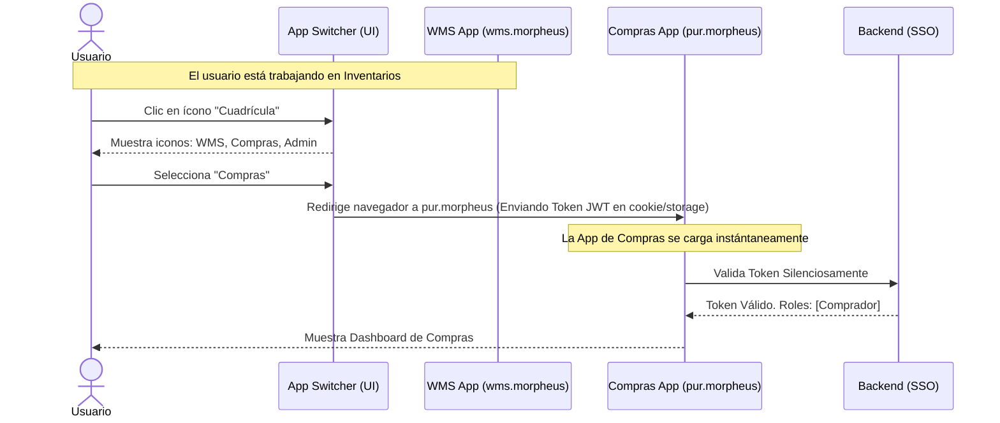

# Propuesta Visual: Interfaz Principal (ERP Layout)

Para mantener la **máxima simplicidad para el usuario final**, cada una de las aplicaciones independientes (WMS, Compras, Admin, etc.) compartirá una estructura visual idéntica y minimalista. Esto asegura que la curva de aprendizaje sea nula al cambiar de un módulo a otro.

## Estructura del Layout (Diseño Base)

La pantalla se divide en tres zonas clave, eliminando cualquier distracción innecesaria:

### 1. Menú Lateral (Sidebar)
*   **Minimalista:** Solo muestra las opciones relevantes para el módulo actual (Ej: Si estás en "Inventarios", solo ves *Recepciones*, *Despachos*, *Ajustes*, *Catálogo*).
*   **Colapsable:** Se puede ocultar para maximizar el espacio de trabajo en tablas de datos grandes.
*   **Iconografía Clara:** Uso de iconos simples (PrimeIcons o Material) para un rápido reconocimiento visual, evitando leer demasiado texto.

### 2. Barra Superior (Header / Topbar)
*   **App Switcher (Selector de Apps):** Un ícono de cuadrícula (similar al de Google) que despliega los módulos a los que el usuario tiene acceso. Esto permite saltar entre *Morpheus WMS* y *Morpheus Compras* con un solo clic.
*   **Buscador Universal (Global Search):** Una barra de búsqueda rápida para encontrar directamente un Folio de Pedido, un SKU o un Cliente, sin tener que navegar por los menús paso a paso.
*   **Contexto del Módulo:** Título claro que indica en qué aplicación/área está el usuario (ej: "Morpheus ERP - Sistema de Almacenes").
*   **Perfil y Notificaciones:** Acceso rápido a cierre de sesión y avisos críticos del sistema (ej: "Lote próximo a vencer").

## Flujo de Navegación: El "App Switcher"

Para ilustrar cómo un usuario viaja de una aplicación a otra sin perder su sesión, hemos diseñado cómo se vería el menú de cambio de aplicación.

### Diagrama de Flujo de Navegación (Single Sign-On SSO)

Cuando un usuario decide cambiar de la aplicación WMS a la de Compras, el proceso es transparente. El token de seguridad (JWT) guardado en el navegador se comparte entre los subdominios (o rutas base), por lo que no se le vuelve a pedir contraseña.

### 3. Área de Trabajo Principal (Main Content)
*   **Fondo Claro y Limpio:** Uso de colores blancos y grises muy suaves para promover lectura rápida y no cansar la vista durante jornadas de 8 horas.
*   **Tarjetas de Resumen (Highlight Cards):** En las pantallas de inicio (Dashboards), se muestran los 3 o 4 indicadores vitales que el usuario necesita ver al empezar su día, para ir directo a la acción.
*   **Tablas de Datos (DataTables PrimeNG):** La información se lista en tablas ordenadas, con filtros rápidos en los encabezados y acciones estandarizadas (Ver detalle, Editar) de forma uniforme en todas las pantallas.

> [!TIP]
> **Consistencia Técnica:** Este layout se construirá una única vez dentro de la librería compartida `@morpheus/ui` usando componentes estándar (`p-sidebar`, `p-menubar`, `p-card`, `p-table`). De este modo, garantizamos que todas las aplicaciones futuras compartan esta misma estética premium sin esfuerzo adicional de desarrollo.
