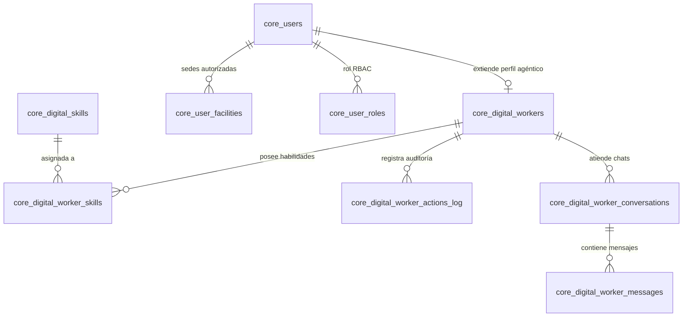

# Arquitectura y Modelado de Usuarios Digitales (AI Workers) en Morpheus ERP

**Documento Técnico Oficial de Diseño, Base de Datos y Roadmap de Implementación**  
**Proyecto:** Morpheus ERP (NEO ERP)  
**Ubicación:** `docs/ARQUITECTURA_Y_MODELADO_USUARIOS_DIGITALES_AI.md`  
**Fecha:** Septiembre 2026  
**Estado:** Aprobado para Fase de Desarrollo  

---

## 1. Visión General y Justificación Arquitectónica

### 1.1. ¿Qué es un Usuario Digital en Morpheus ERP?
Un **Usuario Digital (AI Employee / Digital Worker)** es un agente de software autónomo, dotado de inteligencia artificial generativa y probabilística, que opera dentro de Morpheus ERP con una **identidad legal de primera clase** en el sistema, un rol formal dentro de la matriz RBAC (*Role-Based Access Control*), sucursales físicas asignadas, y canales de comunicación interactivos (WhatsApp y Web).

### 1.2. Superación del Modelo Tradicional de "Scripts Fantasmas"
Históricamente, los ERPs automatizan tareas mediante rutinas *cron* ciegas. Este enfoque presenta limitaciones críticas que el modelo de Usuarios Digitales resuelve:

| Dimensión | Automatización Tradicional (Script / Cron Ciego) | Modelo Morpheus: Usuario Digital (AI Worker) |
| :--- | :--- | :--- |
| **Identidad y Auditoría** | Modifica la base de datos como un "fantasma" o con el usuario maestro del sistema (`admin`). En el Kardex no se sabe quién generó el movimiento. | Posee registro formal en `core.users` con ID propio, correo corporativo (`arturo.wms@morpheus.internal`), nombre y avatar. Cada documento lleva su firma (`created_by_id`). |
| **Seguridad y Alcance** | Se conecta con credenciales globales de base de datos sin someterse a la matriz de permisos. | Está restringido por el rol asignado en `core.roles` y las sedes físicas asignadas en `core.user_facilities`. |
| **Principio de 4 Ojos** | Suele forzar la aprobación directa de datos, arriesgando inconsistencias contables o de stock. | **Genera borradores (`status = 'draft'` / `'PENDING'`)**. Diagnostica, agrupa y propone; un supervisor humano valida y confirma. |
| **Comunicación Operativa** | Si encuentra un fallo, escribe en un log del servidor que el personal de compras o almacén nunca lee. | **Es proactivo y social**: Redacta diagnósticos ejecutivos y los despacha por WhatsApp a los responsables directos. |
| **Interacción** | Unidireccional e inerte. Nadie puede preguntarle nada. | **Conversacional y Reactivo**: Los empleados autorizados pueden consultarle dudas operativas por WhatsApp en lenguaje natural. |

---

## 2. Arquitectura Multi-Agente: ¿Por qué Agentes Especializados y NO un "Bot Todólogo"?

Aunque técnicamente sería factible agrupar todas las capacidades del ERP en un único usuario digital ("Morpheus Bot"), dicha práctica es altamente desaconsejada por las siguientes razones:

```
                  ECOSISTEMA MULTI-AGENTE MORPHEUS
  ┌─────────────────────────────────────────────────────────────┐
  │                                                             │
  │   [ 🤖 Arturo WMS ]              [ 🤖 Clara Compras ]       │
  │   - Auditoría Stock Negativo     - Proyección de Demanda    │
  │   - Borradores Ajuste Mermas     - ODCs Sugeridas (Borrador)│
  │   - Devoluciones y Averías       - Notificación a Comprador │
  │   - Conciliación 3-Way Match     - Seguimiento Lead Times   │
  │                                                             │
  │   [ 🤖 Mateo Costos ]            [ 🤖 Sofía Finanzas ]      │
  │   - Desviación de Márgenes       - Vencimiento de Facturas  │
  │   - Variación Costo Reposición   - Descuentos Pronto Pago   │
  │   - Impacto de Tasa BCV          - Alerta Flujo de Caja     │
  │                                                             │
  └─────────────────────────────────────────────────────────────┘
```

1. **Prevención de la Dilución de Contexto en el LLM (*Context Drift*):**
   Un modelo de lenguaje (ej. Gemini) saturado con 40 herramientas simultáneas de compras, almacén, facturación, precios y nómina comete más alucinaciones y errores de selección de herramientas. Con agentes especializados, el *System Prompt* y las herramientas expuestas corresponden con precisión quirúrgica a su dominio.
2. **Segregación de Funciones Corporativas (Control Interno):**
   En una empresa sana, **el que compra no ajusta inventario**, y **el que audita mermas no cambia los precios de venta**. Crear usuarios digitales separados garantiza que el agente de Compras tenga rol de Comprador y el de WMS tenga rol de Almacén, respetando los principios de auditoría interna.
3. **Claridad en la Trazabilidad:**
   Al revisar el historial de una orden de compra o un movimiento de almacén, la trazabilidad es inmediata:
   - *"Orden de Compra creada por: Clara Compras (AI) - Pendiente por Confirmar por: Juan Pérez"*.
   - *"Borrador de Ajuste creado por: Arturo WMS (AI) - Validado por: Supervisor de Almacén"*.
4. **Segmentación de Audiencias en WhatsApp:**
   Los proveedores solo deben hablar con Compras sobre entregas y cotizaciones. Los transportistas y operarios de muelle hablan con WMS sobre bultos y averías. Mantener identidades separadas evita mezclar canales y audiencias.

---

## 3. Modelado de Base de Datos (PostgreSQL)

El modelado relacional desacopla la **identidad del usuario** (que vive en `core.users` como cualquier empleado de la empresa) de su **perfil de inteligencia y configuración agéntica** (`core.digital_workers`), permitiendo además vincular N habilidades y mantener bitácoras exhaustivas de auditoría.

### 3.1. Diagrama Entidad-Relación (Mermaid)



### 3.2. Script DDL de Migración SQL

```sql
-- ==============================================================================
-- 1. EXTENSIÓN DEL MAESTRO DE USUARIOS
-- ==============================================================================
ALTER TABLE core.users 
ADD COLUMN IF NOT EXISTS user_type VARCHAR(30) DEFAULT 'HUMAN' CHECK (user_type IN ('HUMAN', 'DIGITAL_WORKER', 'SYSTEM_BOT')),
ADD COLUMN IF NOT EXISTS phone_number VARCHAR(30),
ADD COLUMN IF NOT EXISTS is_phone_verified BOOLEAN DEFAULT FALSE,
ADD COLUMN IF NOT EXISTS pairing_pin VARCHAR(10),
ADD COLUMN IF NOT EXISTS avatar_url TEXT;

-- ==============================================================================
-- 2. TABLA MAESTRA DE USUARIOS DIGITALES
-- ==============================================================================
CREATE TABLE IF NOT EXISTS core.digital_workers (
    id SERIAL PRIMARY KEY,
    user_id INT NOT NULL UNIQUE REFERENCES core.users(id) ON DELETE CASCADE,
    agent_code VARCHAR(50) NOT NULL UNIQUE,          -- ej: 'ARTURO_WMS', 'CLARA_COMPRAS'
    display_title VARCHAR(100) NOT NULL,            -- ej: 'Supervisor Digital de Almacenes'
    operational_module VARCHAR(50) NOT NULL,        -- 'WMS', 'PURCHASES', 'PRICING', 'FINANCE'
    system_prompt TEXT NOT NULL,                    -- Directrices de personalidad y límites
    model_name VARCHAR(50) DEFAULT 'gemini-2.5-flash',
    is_autonomous_active BOOLEAN DEFAULT TRUE,      -- Switch ON/OFF de corridas periódicas
    scan_interval_minutes INT DEFAULT 60,           -- Frecuencia de escaneo
    channel_config JSONB DEFAULT '{"whatsapp_enabled": true}'::jsonb,
    guardrails_config JSONB DEFAULT '{
        "force_draft_state": true,
        "max_draft_amount_usd": 50000.00,
        "require_human_confirmation": true
    }'::jsonb,
    last_scan_at TIMESTAMP WITH TIME ZONE,
    created_at TIMESTAMP WITH TIME ZONE DEFAULT NOW()
);

-- ==============================================================================
-- 3. CATÁLOGO DE HABILIDADES Y ASIGNACIÓN
-- ==============================================================================
CREATE TABLE IF NOT EXISTS core.digital_skills (
    id SERIAL PRIMARY KEY,
    skill_code VARCHAR(60) NOT NULL UNIQUE,          -- ej: 'mrp_draft_purchase_suggester'
    operational_module VARCHAR(50) NOT NULL,        -- 'WMS', 'PURCHASES', etc.
    name VARCHAR(100) NOT NULL,
    description TEXT NOT NULL,
    execution_type VARCHAR(20) DEFAULT 'NATIVE_CODE' CHECK (execution_type IN ('NATIVE_CODE', 'DECLARATIVE_PROMPT')),
    handler_function VARCHAR(100),                  -- Función en Python si es nativa
    declarative_prompt TEXT,                        -- Prompt si es declarativa (Fase 6)
    created_at TIMESTAMP WITH TIME ZONE DEFAULT NOW()
);

CREATE TABLE IF NOT EXISTS core.digital_worker_skills (
    id SERIAL PRIMARY KEY,
    worker_id INT NOT NULL REFERENCES core.digital_workers(id) ON DELETE CASCADE,
    skill_id INT NOT NULL REFERENCES core.digital_skills(id) ON DELETE CASCADE,
    is_enabled BOOLEAN DEFAULT TRUE,
    parameters JSONB DEFAULT '{}'::jsonb,
    created_at TIMESTAMP WITH TIME ZONE DEFAULT NOW(),
    UNIQUE(worker_id, skill_id)
);

-- ==============================================================================
-- 4. BITÁCORA Y AUDITORÍA DE ACCIONES AUTÓNOMAS
-- ==============================================================================
CREATE TABLE IF NOT EXISTS core.digital_worker_actions_log (
    id BIGSERIAL PRIMARY KEY,
    worker_id INT NOT NULL REFERENCES core.digital_workers(id) ON DELETE CASCADE,
    facility_id INT REFERENCES core.facilities(id),
    action_type VARCHAR(60) NOT NULL,               -- 'NEGATIVE_STOCK_FOUND', 'DRAFT_PO_CREATED', etc.
    target_entity_type VARCHAR(50),                 -- 'inventory_snapshot', 'purchase_order'
    target_entity_id VARCHAR(50),                   -- ID del documento generado o auditado
    severity VARCHAR(20) DEFAULT 'INFO' CHECK (severity IN ('INFO', 'WARNING', 'CRITICAL')),
    summary TEXT NOT NULL,
    details JSONB,
    recipient_target VARCHAR(100),                  -- Número de WhatsApp o correo destino
    status VARCHAR(30) DEFAULT 'COMPLETED',
    created_at TIMESTAMP WITH TIME ZONE DEFAULT NOW()
);

-- ==============================================================================
-- 5. CONVERSACIONES Y MEMORIA PARA WHATSAPP
-- ==============================================================================
CREATE TABLE IF NOT EXISTS core.digital_worker_conversations (
    id BIGSERIAL PRIMARY KEY,
    worker_id INT NOT NULL REFERENCES core.digital_workers(id) ON DELETE CASCADE,
    channel VARCHAR(30) NOT NULL DEFAULT 'WHATSAPP',
    external_sender_id VARCHAR(50) NOT NULL,        -- Teléfono normalizado E.164 (+584121234567)
    sender_user_id INT REFERENCES core.users(id),
    sender_supplier_id INT REFERENCES core.suppliers(id),
    is_authenticated BOOLEAN DEFAULT FALSE,
    context_data JSONB DEFAULT '{}'::jsonb,
    created_at TIMESTAMP WITH TIME ZONE DEFAULT NOW()
);

CREATE TABLE IF NOT EXISTS core.digital_worker_messages (
    id BIGSERIAL PRIMARY KEY,
    conversation_id BIGINT NOT NULL REFERENCES core.digital_worker_conversations(id) ON DELETE CASCADE,
    sender_type VARCHAR(20) NOT NULL CHECK (sender_type IN ('USER', 'WORKER', 'SYSTEM')),
    content TEXT NOT NULL,
    tool_calls JSONB,
    created_at TIMESTAMP WITH TIME ZONE DEFAULT NOW()
);

CREATE INDEX IF NOT EXISTS idx_dw_actions_worker ON core.digital_worker_actions_log(worker_id, created_at);
CREATE INDEX IF NOT EXISTS idx_dw_conv_sender ON core.digital_worker_conversations(external_sender_id);
```

---

## 4. Casos de Uso Operativos de Referencia

### 4.1. Caso 1: Arturo WMS (Almacén y Logística)
- **Identidad:** `arturo.wms@morpheus.internal`, Rol `Supervisor WMS`.
- **Habilidades Asignadas:**
  1. `negative_stock_auditor`: Audita `inv.inventory_snapshots` buscando saldos `< 0`. Diagnostica el origen rastreando `inv.stock_moves` y redacta un borrador de ajuste en `inv.inventory_adjustments` en estado `PENDING` para conteo físico.
  2. `dock_returns_and_scrap_monitor`: Detecta mercancía devuelta en muelle (`reject_at_dock = True`) o mermas enviadas a ubicación `SCRAP`. Notifica automáticamente al proveedor vía WhatsApp exigiendo la Nota de Crédito y alerta al comprador humano.
  3. `3way_unreconciled_watchdog`: Identifica órdenes recibidas físicamente en almacén con más de 48 horas sin cruce con factura fiscal, alertando al analista de cuentas por pagar antes de perder descuentos por pronto pago.

### 4.2. Caso 2: Clara Compras (Compras y Abastecimiento)
- **Identidad:** `clara.compras@morpheus.internal`, Rol `Analista de Compras`.
- **Habilidades Asignadas:**
  1. `mrp_demand_predictor`: Consulta stock físico, ventas promedio diarias (`sales_run_rate`) y órdenes en tránsito para calcular el punto de reorden y el stock de seguridad estadístico con 95% de nivel de servicio.
  2. `draft_po_generator`: Cuando un producto está por debajo del umbral crítico, agrupa las necesidades por proveedor, redondea a bultos maestros (*Packagings*) respetando el pedido mínimo (*MOQ*) y genera la Orden de Compra en `pur.purchase_orders` en estado **`draft` (Borrador)** firmada con su ID.
  3. `purchase_whatsapp_notifier`: Despacha un mensaje por WhatsApp al Comprador Humano:
     > *"Hola Carlos, he analizado las ventas de Patio Trigal. Acabo de generar 2 órdenes de compra sugeridas en borrador (Alfonzo Rivas por $12,400 y Monaca por $8,150) para tu revisión y firma."*

### 4.3. Caso 3: Mateo Costos (Costos y Precios)
- **Identidad:** `mateo.costos@morpheus.internal`, Rol `Analista de Precios y Costos`.
- **Habilidades Asignadas:**
  1. `bcv_margin_impact_analyzer`: Evalúa si la actualización de la tasa oficial BCV provocó que productos con precio congelado en bolívares cayeran por debajo del margen mínimo de ganancia (ej. 25%).
  2. `draft_pricing_session_creator`: Agrupa los productos afectados y genera una Sesión de Ajuste de Precios en borrador en `pricing_sessions` para revisión y autorización del Gerente Comercial.

---

## 5. Canal Conversacional WhatsApp y Protocolo de Seguridad

```
   [Usuario / Analista / Proveedor en WhatsApp]
                        │
                        │ Mensaje entrante ("¿Clara, por qué sugeriste pedir 400 bultos de harina?")
                        ▼
   ┌────────────────────────────────────────────────────────────┐
   │ FastAPI Webhook: POST /api/v1/digital-workers/whatsapp/hook│
   └────────────────────────────┬───────────────────────────────┘
                                │
                                ▼
   ┌────────────────────────────────────────────────────────────┐
   │ 1. Verificación de Seguridad Meta & Normalización E.164    │
   │    - Valida firma criptográfica X-Hub-Signature-256        │
   │    - Normaliza teléfono a formato internacional (+58...)   │
   └────────────────────────────┬───────────────────────────────┘
                                │
                                ▼
   ┌────────────────────────────────────────────────────────────┐
   │ 2. Autenticación por PIN de Dispositivo (Device Pairing)   │
   │    - Si el número no está verificado en core.users:        │
   │      Responde: "Dispositivo no reconocido. Ingresa a Neo   │
   │      Core, genera tu PIN de 6 dígitos y responde:          │
   │      Vincular [PIN] para habilitar el acceso."             │
   └────────────────────────────┬───────────────────────────────┘
                                │
                                ▼
   ┌────────────────────────────────────────────────────────────┐
   │ 3. Invocación de Agente Gemini con Function Calling        │
   │    Herramientas autorizadas según el Rol del Emisor:       │
   │    - query_product_stock()                                 │
   │    - explain_mrp_suggestion()                              │
   │    - get_pending_returns()                                 │
   └────────────────────────────┬───────────────────────────────┘
                                │
                                ▼
   ┌────────────────────────────────────────────────────────────┐
   │ 4. Respuesta Generada y Despachada por WhatsApp:           │
   │    "Porque la tasa de venta subió a 38 bultos/día y solo   │
   │     quedan 80 en Patio Trigal. Como Alfonzo Rivas tarda 8  │
   │     días en despachar, nos habríamos quedado sin stock."   │
   └────────────────────────────────────────────────────────────┘
```

---

## 6. Fases de Desarrollo y Hoja de Ruta (Roadmap Gradual)

Siguiendo el criterio directivo de **construir y validar rigurosamente primero las habilidades nativas por código antes de habilitar la creación dinámica**, el desarrollo se divide en 6 fases estrictas:

```
[ Fase 1: Base de Datos ] ➔ [ Fase 2: Habilidades en Código ] ➔ [ Fase 3: Scheduler Backend ]
                                                                             │
[ Fase 6: Skill Studio ]  ◀─ [ Fase 5: UI Neo Core ] ◀─ [ Fase 4: WhatsApp ] ┘
  (Fase Final No-Code)
```

### Fase 1: Cimientos de Base de Datos y Modelo de Entidades
- Ejecutar la migración DDL creando `core.digital_workers`, `core.digital_skills`, `core.digital_worker_skills` y `core.digital_worker_actions_log`.
- Sembrar las cuentas iniciales de prueba en `core.users`:
  - `arturo.wms@morpheus.internal` (Rol: *Supervisor de Almacén*).
  - `clara.compras@morpheus.internal` (Rol: *Analista de Compras*).
- Asignar sucursales base en `core.user_facilities`.

### Fase 2: Implementación y Validación Rigurosa de Habilidades en Código (Python)
- **Implementar en código nativo las habilidades críticas iniciales:**
  - `negative_stock_auditor`: Escaneo de existencias negativas y creación de borradores de ajuste `inv.inventory_adjustments` (`PENDING`).
  - `mrp_purchase_suggester`: Algoritmo de punto de reorden y generación de ODCs en `pur.purchase_orders` (`draft`) agrupadas por proveedor y redondeadas a empaques maestros.
  - `reconciliation_watchdog`: Monitoreo de recepciones sin cruce de factura fiscal.
- **Protocolo de Pruebas Unitarias e Integrales:**
  - Validar contra la base de datos real en QA.
  - Asegurar que los cálculos matemáticos (MRP, días de cobertura, stock de seguridad) y las transacciones de base de datos sean 100% deterministas y consistentes.

### Fase 3: Scheduler Autónomo en el Backend (Daemon Lifespan)
- Crear el ciclo de fondo asíncrono `run_digital_workers_scheduler()` en el `lifespan` de FastAPI.
- El daemon despierta a los trabajadores digitales según su `scan_interval_minutes`, evalúa sus habilidades asignadas y registra cada hallazgo en `core.digital_worker_actions_log`.
- Incorporar control de guardrails (respetar montos máximos y estados en borrador).

### Fase 4: Conector WhatsApp y Protocolo de Diálogo Seguro
- Implementar el endpoint Webhook `POST /api/v1/digital-workers/whatsapp/hook` con verificación de firma criptográfica Meta (`X-Hub-Signature-256`).
- Implementar el protocolo de emparejamiento seguro por PIN de 6 dígitos (*Device Pairing*) en `core.users`.
- Conectar Gemini 2.5 Flash mediante *Function Calling* nativo para que los usuarios puedan consultar existencias, motivos de sugerencias de compra y estatus de recepciones por chat.

### Fase 5: Interfaz de Gestión en Neo Core
- Agregar el distintivo visual `[🤖 Empleado Digital]` en el listado de usuarios de Neo Core (`/dashboard/users`).
- Crear la pantalla de administración de **Empleados Digitales** (`/dashboard/digital-workers`):
  - Creación de nuevos usuarios digitales asignando nombre, módulo, correo y sucursales.
  - Asignación de habilidades mediante checkboxes.
  - Panel de telemetría y bitácora de auditoría en vivo con botón de *"Ejecutar Auditoría Ahora"*.

### Fase 6 (FASE FINAL): Módulo Constructor de Habilidades Declarativas (No-Code Skill Studio)
> **Condición de Entrada:** Esta fase se abordará únicamente después de haber probado, auditado y estabilizado en producción las habilidades nativas por código.
- **Propósito:** Permitir a usuarios de negocio y gerentes crear nuevas habilidades personalizadas sin requerir un programador.
- **Componentes:**
  - Formulario en Neo Core con directivas en lenguaje natural (*"Si un lote vence en menos de 15 días, notificar al jefe de almacén"*).
  - Conexión a primitivas seguras de lectura del ERP (vistas de datos preaprobadas).
  - Restricción estricta de permisos de modificación para evitar que una habilidad declarativa corrompa datos financieros o de inventario.
