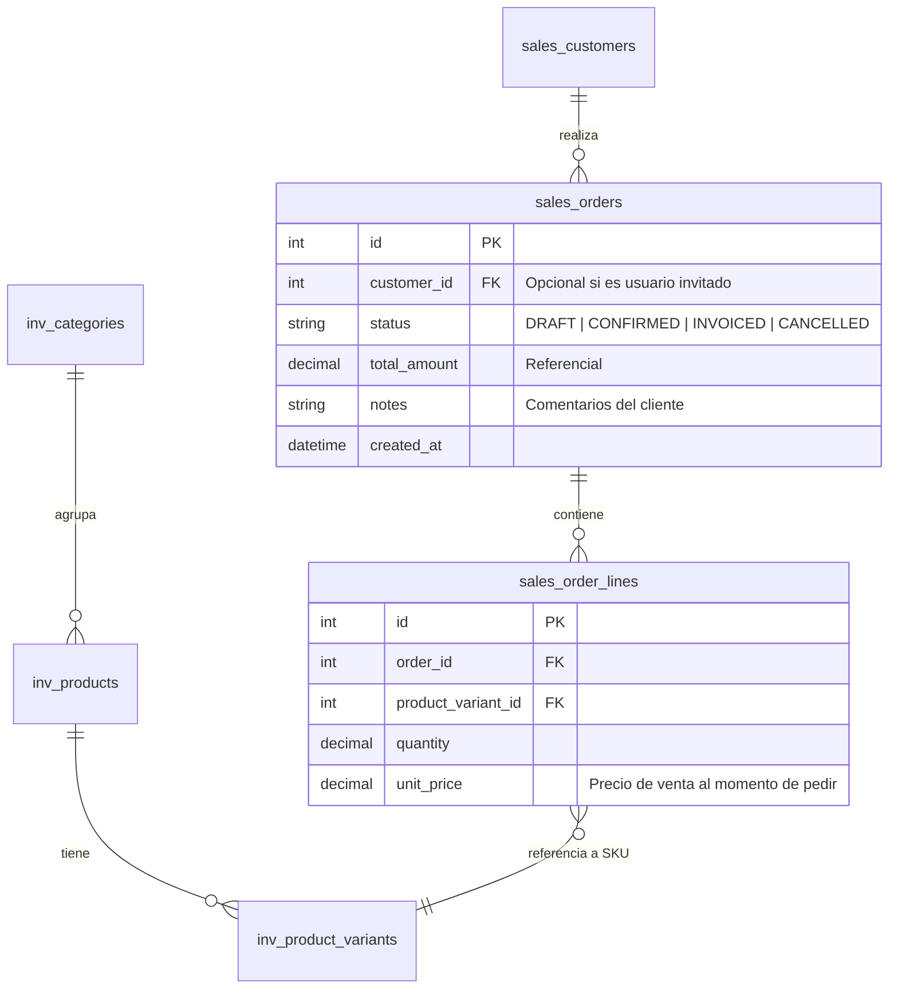
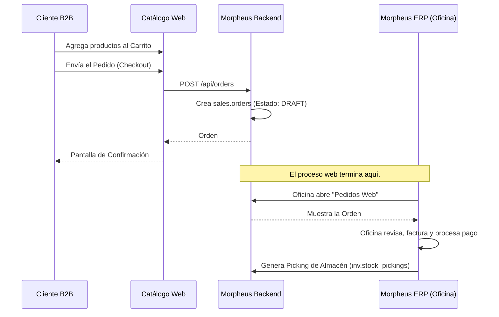

# Arquitectura del Catálogo B2B - Morpheus ERP

## 1. Diseño UI/UX: Experiencia Premium y Dinámica
Al no haber un proceso de pago con tarjeta, la experiencia web se enfoca en la **fricción cero** para agregar productos al carrito y generar solicitudes de compra rápidamente, manteniendo una **excelencia visual**.

* **Estética (Look-and-Feel):** Diseño de vidrio esmerilado (Glassmorphism), sombras suaves y colores en la gama del azul corporativo/oscuro. Interfaz limpia y moderna.
* **Doble Vista (Cuadrícula vs. Lista):** 
    * *Vista de Cuadrícula (Grid):* Imágenes grandes de los productos para explorar visualmente.
    * *Vista de Lista:* Tabla densa pensada para compras B2B rápidas, permitiendo ingresar cantidades al por mayor sin entrar a la ficha del producto.
* **Micro-interacciones:** Notificaciones vibrantes (toasts) al agregar productos y contadores animados en el carrito.
* **Carrito de Pedido (Checkout):** Un proceso simple de un solo paso. El cliente confirma cantidades, agrega detalles de entrega y genera la orden (sin pasarela de pago).

## 2. Modelado de Datos (Base de Datos)
El sistema aprovecha las tablas existentes `inv.products` y `inv.product_variants`. Se añadirá un esquema de ventas (`sales`) para gestionar las intenciones de compra:

## 3. Flujo de Trabajo (Web a ERP)

## 4. Plan de Implementación Técnica

1. **Fase 1: Frontend (`neo-storefront`)**
   Creación de la aplicación en el monorepo usando Next.js 16 (App Router). Uso de Zustand/Context para el estado global del carrito.
2. **Fase 2: APIs de Lectura**
   Endpoints `GET /api/catalog/products` que exponen inventario asegurando que solo los SKUs con `is_published = TRUE` sean visibles.
3. **Fase 3: Recepción de Pedidos**
   Endpoint `POST /api/catalog/orders` que recibe el carrito y graba la orden en estado `DRAFT`.
4. **Fase 4: Integración en Morpheus ERP**
   Creación de módulo visual en el back-office del ERP para que los vendedores aprueben las órdenes entrantes y detonen el proceso logístico.
