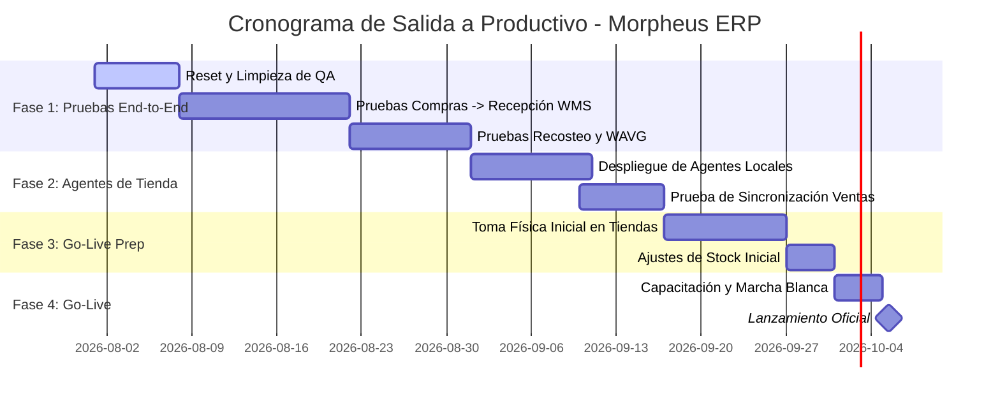

# Plan de Trabajo y Estado de Módulos para Salida a Productivo (Octubre)

Este documento presenta el estado de implementación actual de los cuatro módulos clave (Órdenes de Compra, Recepciones, Inventario, Costo y Precio) y traza la hoja de ruta estratégica para la salida a producción en la primera semana de octubre.

---

## 1. Diagnóstico del Estado Actual de los Módulos

### 📝 A. Órdenes de Compra (`neo-purchases` / `pur`)
* **Estado actual:** **95% (Maduro / Listo para Pruebas)**
* **Funcionalidades Backend:**
  * Endpoint CRUD y aprobación formal de ODCs con bitácora de auditoría.
  * Asignación inteligente del comprador y control de límites de aprobación.
  * Generación de PDF corporativo profesional bimonetario con opción de visualización por códigos de barra o SKU.
  * **Bot MRP Automático (IA):** Motor de cálculo nocturno (3:00 AM) que pronostica demanda a partir de la venta diaria real de los últimos 90 días, aplica ajuste estacional interanual (YoY) y cuenta con tolerancia/fallback automático para sucursales nuevas sin historial de venta.
* **Funcionalidades Frontend:**
  * Vista de grilla con filtros dinámicos de sucursal y proveedor.
  * Editor en caliente: Agregar productos (desde catálogo o maestro general), eliminar productos con opción de desactivación global de SKUs y modificación interactiva de unidades por empaque con guardado permanente en la base maestra.

### 🚚 B. Recepciones (`neo-wms` / WMS)
* **Estado actual:** **90% (Funcional / En fase de integración)**
* **Funcionalidades Backend:**
  * Endpoint transaccional `/wms/receipts/{order_id}` que recibe un manifiesto físico, genera un picking WMS `IN-ODC...` y asienta movimientos de inventario.
  * Control de cantidades parciales (Backorders).
  * Control de trazabilidad por Lote y fecha de vencimiento (FEFO) para alimentos y perecederos.
  * Integración contable: Promedia automáticamente el **Costo Promedio Ponderado (WAVG)** del inventario ante cada entrada.
* **Funcionalidades Frontend:**
  * Bandeja de entrada en muelle de carga mostrando ODCs en tránsito.
  * Formulario de **Conteo Físico Ciego** que oculta los costos al operario y le permite ingresar unidades físicas recibidas, lote y expiración por línea.

### 📦 C. Inventario (`neo-inventory` / `inv`)
* **Estado actual:** **90% (Estable / Completo)**
* **Funcionalidades Backend & Core:**
  * Motor de inventario de doble entrada (Partida Doble Física en `StockMoves` y `StockPickings`) con ubicaciones virtuales (proveedores, mermas, ajustes).
  * Ledger de movimientos físicos (Kardex detallado) e históricos de valoración de inventario.
  * Gestión de tomas físicas (`InventorySession`) con recuento ciego y generación de ajustes automáticos de pérdida/ganancia.
* **Funcionalidades Frontend:**
  * Catálogo de productos y variantes con precios y costos maestros.
  * Módulos de consulta de Kardex e histórico de valoración comercial.
  * Impresión personalizada de etiquetas y habladores de precios con códigos de barra.
  * Mapeador de categorías en árbol jerárquico.

### 🏷️ D. Costo y Precio (`neo-pricing` / `pricing`)
* **Estado actual:** **85% (Funcional / Requiere Pruebas Masivas)**
* **Funcionalidades Backend & Core:**
  * Sesiones de recosteo masivo a través de importación de archivos de proveedores (Excel/CSV) con mapeo inteligente mediante IA (Gemini).
  * Simulación y aplicación de nuevos precios basándose en márgenes objetivos o tasa cambiaria del día.
  * Soporte cambiario completo: Actualización de tasa cambiaria (VES/USD) con recosteo dinámico.
* **Funcionalidades Frontend:**
  * Mapeador y cargador visual de listas de costo de proveedores.
  * Grilla interactiva de modificación de costos y precios de venta.
  * Kiosco self-service de consulta de precios para clientes.

---

## 2. Plan de Trabajo: Ruta hacia la Salida a Productivo (Octubre)
Con una ventana de aproximadamente **9 semanas** de desarrollo, pruebas e implementación (Agosto y Septiembre), dividiremos el trabajo en 4 fases críticas:

### 🗓️ Fase 1: Pruebas End-to-End y Ajustes de QA (Agosto)
*   **Semana 1 (Agosto 1 - 7):** Ejecutar la limpieza de QA e importar los catálogos limpios desde el agente local.
*   **Semanas 2 y 3 (Agosto 8 - 21):** Pruebas del ciclo comercial completo:
    1.  El Bot genera propuestas de ODC.
    2.  El analista modifica y aprueba la ODC.
    3.  Se simula la recepción en `neo-wms` confirmando cantidades y lotes.
    4.  Verificar que el Kardex y las existencias en `neo-inventory` se actualicen de manera transaccional perfecta.
*   **Semana 4 (Agosto 22 - 31):** Validar la recalculación de Costo Promedio (WAVG) en las recepciones y los flujos de recosteo masivo por lote/Gemini en el módulo de precios.

### 🗓️ Fase 2: Configuración del Agente local en Producción (Septiembre 1 - 15)
*   **Semana 5 (Septiembre 1 - 10):** Instalar el agente de sincronización en la máquina de producción de la tienda física.
*   **Semana 6 (Septiembre 10 - 15):** Pruebas de fuego de la cola SQLite local del agente ante desconexiones de red, garantizando que el tráfico de ventas diaria fluya sin pérdidas ni duplicados en el servidor en la nube de QA.

### 🗓️ Fase 3: Auditorías Físicas y Carga de Stock Inicial (Septiembre 16 - 30)
*   **Semana 7 y 8 (Septiembre 16 - 26):** Programar y realizar la **Toma Física General de Inventario** en las tiendas utilizando el módulo `physical-counts` de `neo-inventory` para congelar el stock de partida exacto.
*   **Semana 9 (Septiembre 27 - 30):** Consolidar diferencias, ejecutar el ajuste final de stock y bloquear saldos iniciales.

### 🗓️ Fase 4: Capacitación y Lanzamiento Oficial (Octubre 1 - 5)
*   **Octubre 1 - 4:** Capacitación rápida a operarios de muelle (recepción), analistas de compras (ODC) y administradores de precios.
*   **Lunes 5 de Octubre: Go-Live Oficial.** Salida a productivo con encendido automático de Bots y agentes de venta en vivo.
