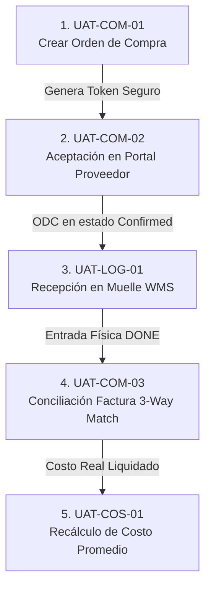

# 📘 Manual de Pruebas UAT - Sesión 1 (Martes): Cadena de Abastecimiento, Muelle y Costos

**Proyecto:** Morpheus ERP / WMS  
**Entorno de Pruebas:** QA Staging (`https://hub.qa.morpheussoft.net`)  
**Fecha de Ejecución:** Martes, 8 de Septiembre de 2026  
**Audiencia / Evaluadores:** Equipo de Compras, Analistas de Cuentas por Pagar, Jefes de Almacén y Finanzas  
**Documento Base:** [`docs/protocolo_pruebas_integrales_uat_cliente.md`](file:///home/lzambrano/Desarrollo/Morpheus/docs/protocolo_pruebas_integrales_uat_cliente.md)

---

## 🧭 Regla de Oro Operativa: El Punto de Partida Siempre es el Core

> **IMPORTANTE:** Para garantizar la persistencia de la sesión única (*Single Sign-On*) y la correcta contextualización de la sucursal activa, **todas las pruebas deben iniciarse estrictamente desde el Hub Central (Neo Core)**:
> 
> 1. Abrir el navegador e ingresar a: **`https://hub.qa.morpheussoft.net`**
> 2. Iniciar sesión con el usuario y contraseña del rol correspondiente.
> 3. Verificar en la barra superior que esté seleccionada la Sucursal de Prueba (ej. **`PATIO TRIGAL`**).
> 4. Hacer clic en el **AppSwitcher** (el menú de 9 puntos en la barra superior derecha) para conmutar al módulo correspondiente de cada prueba.

```
┌────────────────────────────────────────────────────────────────────────────────┐
│  [⚡ Morpheus Core]  Sucursal: [ PATIO TRIGAL ▼ ]        [::: AppSwitcher] [AD]│
└───────────────────────────────────────┬────────────────────────────────────────┘
                                        │
             ┌──────────────────────────┴──────────────────────────┐
             ▼                          ▼                          ▼
     [🛒 Neo Compras]           [🚚 Neo Logística/WMS]     [💲 Costos & Precios]
    (Puerto /compras)               (Puerto /wms)              (Puerto /costos)
```

---

## ⛓️ Mapa de Prelaciones y Dependencias de la Sesión

Para que las pruebas de este día fluyan sin interrupciones, deben ejecutarse en este **orden estricto**, ya que cada una genera el insumo necesario para la siguiente:



1. **`UAT-COM-01` prela a `UAT-COM-02`:** No se puede probar el portal público de proveedores sin haber emitido una Orden de Compra con condiciones comerciales.
2. **`UAT-COM-02` prela a `UAT-LOG-01`:** El muelle de recepción no debe recibir mercancía que no haya sido confirmada/autorizada previamente.
3. **`UAT-LOG-01` prela a `UAT-COM-03`:** La conciliación 3-Way Match compara tres elementos: la ODC original, la factura física del proveedor y **la recepción real contada en muelle**.
4. **`UAT-LOG-01` y `UAT-COM-03` prelan a `UAT-COS-01`:** El Kardex y la fórmula de Costo Promedio Ponderado solo se disparan cuando entra inventario a un costo nuevo liquidado.

---

## 🧪 CASO 1: Ciclo de Vida de la Orden de Compra y Condiciones Comerciales

* **ID Protocolo:** `UAT-COM-01`
* **👤 Evaluador Responsable:** Comprador / Analista de Abastecimiento.
* **⏱️ Tiempo Estimado:** 15 minutos.

### 🎯 1. Objetivo de Negocio
Emitir una Orden de Compra formal con manejo bimonetaria (USD / Bs), tiempos de entrega y descuentos comerciales encadenados (ej. `10+5%`), verificando la precisión matemática de los impuestos y subtotales.

### 📝 2. Datos de Prueba Sugeridos
* **Proveedor:** Seleccionar un proveedor real del catálogo (ej. *ALIMENTOS POLAR COMERCIAL* o similar).
* **Moneda:** `USD`
* **Productos:**
  * Ítem 1: 100 unidades a $10.00 c/u (con descuento comercial `10+5%`).
  * Ítem 2: 50 unidades a $20.00 c/u.
* **Condición de Pago:** Crédito 15 días.

### 🖱️ 3. Paso a Paso Guiado (Desde el Core)
1. Ingresar a **`https://hub.qa.morpheussoft.net`** e iniciar sesión con usuario de compras.
2. En la barra superior, hacer clic en el **AppSwitcher (9 puntos)** y seleccionar **"Neo Compras"**.
3. El navegador te redirigirá fluidamente a `https://compras.qa.morpheussoft.net/compras`.
4. En el menú lateral izquierdo, hacer clic en **"Órdenes de Compra"**.
5. Presionar el botón superior derecho **`+ Nueva Orden`**.
6. Completar el encabezado:
   * Seleccionar el **Proveedor**.
   * Moneda: **USD**.
   * Sucursal destino: **Patio Trigal**.
7. En la tabla de renglones, agregar los 2 productos de prueba indicando cantidades, precios y en el campo de descuento colocar `10+5`.
8. Observar el recálculo automático del cuadro de liquidación inferior.
9. Presionar **`Guardar y Enviar a Aprobación`**.
10. Como supervisor, presionar **`Autorizar Orden`**. La orden pasará a estado **`SENT`** (Enviada).
11. **Anotar el Número de Orden:** `ODC-_________` (lo usaremos en las siguientes pruebas).

### 👁️ 4. Resultado Esperado en Pantalla
* ✅ La ODC se genera con numeración correlativa limpia (ej. `ODC-000001`).
* ✅ El descuento encadenado `10+5%` descuenta primero el 10% y sobre el saldo el 5% (descuento efectivo del 14.5%, no lineal del 15%).
* ✅ La orden queda en estado `SENT` y genera un botón **"Copiar Enlace de Portal Proveedor"**.

### ✍️ 5. Hoja de Evaluación
* **Resultado:** [ ] 🟢 Conforme (OK)   [ ] 🟡 Conforme con Observación   [ ] 🔴 No Conforme
* **Observaciones:** __________________________________________________
* **Firma Evaluador:** _______________________

---

## 🧪 CASO 2: Portal Público Interactivo del Proveedor (Sin Login)

* **ID Protocolo:** `UAT-COM-02`
* **👤 Evaluador Responsable:** Comprador (simulando ser el Proveedor externo).
* **⏱️ Tiempo Estimado:** 10 minutos.
* **Prerrequisito:** Haber completado `UAT-COM-01` (ODC en estado `SENT`).

### 🎯 1. Objetivo de Negocio
Comprobar que el proveedor externo puede consultar su pedido desde cualquier dispositivo mediante un enlace seguro con token temporal (sin requerir usuario ni contraseña en Morpheus) y confirmar la aceptación del pedido en tiempo real.

### 🖱️ 3. Paso a Paso Guiado
1. En la ficha de la Orden de Compra creada en el Caso 1, hacer clic en el botón **`🔗 Compartir Portal Proveedor`** o copiar el enlace seguro.
2. Abrir una **ventana de incógnito** o navegador externo (para simular ser el proveedor fuera de la empresa) y pegar el enlace:
   *(Formato: `https://compras.qa.morpheussoft.net/public/orders/{token}`)*.
3. Observar la pantalla pública de confirmación de pedido:
   * Verificar que se vea el membrete corporativo, la lista de productos demandados y la fecha estimada de entrega.
4. Como proveedor, hacer clic en el botón verde **`✅ Confirmar / Aceptar Pedido`**.
5. Opcional: Escribir una nota del proveedor: *"Confirmado despacho para el día de mañana a las 8:00 AM"*.
6. Volver a la ventana principal de Morpheus (Neo Compras) y refrescar la Orden de Compra.

### 👁️ 4. Resultado Esperado en Pantalla
* ✅ El proveedor puede ver su pedido sin pedirle login.
* ✅ En Morpheus, la orden cambia automáticamente de `SENT` a **`CONFIRMED`**.
* ✅ En la ficha interna queda registrada la fecha/hora de lectura del proveedor (`seen_at`) y la IP/nota de aceptación.

### ✍️ 5. Hoja de Evaluación
* **Resultado:** [ ] 🟢 Conforme (OK)   [ ] 🟡 Conforme con Observación   [ ] 🔴 No Conforme
* **Observaciones:** __________________________________________________
* **Firma Evaluador:** _______________________

---

## 🧪 CASO 3: Recepción Física en Muelle contra Orden de Compra (WMS)

* **ID Protocolo:** `UAT-LOG-01`
* **👤 Evaluador Responsable:** Jefe de Muelle / Almacenista Receptor.
* **⏱️ Tiempo Estimado:** 15 minutos.
* **Prerrequisito:** Orden de Compra confirmada (`UAT-COM-01` / `02`).

### 🎯 1. Objetivo de Negocio
Recibir la mercancía física en el muelle de carga contra la Orden de Compra autorizada, ingresando números de lote, vencimientos y cantidades recibidas reales (validando recepciones totales o parciales).

### 🖱️ 3. Paso a Paso Guiado (Desde el Core)
1. En la barra superior, hacer clic en el **AppSwitcher (9 puntos)** y seleccionar **"Neo Logística (WMS)"**.
2. El sistema abrirá `https://logistica.qa.morpheussoft.net/wms`.
3. En el menú lateral, seleccionar **"Recepciones (Inbound)"** (o acceder desde la tarjeta *Muelle de Recepción* del Dashboard).
4. Presionar **`+ Nueva Recepción`**.
5. En el selector de origen, buscar y elegir la Orden de Compra creada en el Caso 1 (`ODC-000001`).
6. El sistema cargará automáticamente los productos acordados con el proveedor.
7. Para el Producto 1:
   * Indicar la cantidad física recibida: `100`.
   * Asignar un número de Lote de prueba: `LOT-2026-A1`.
   * Indicar Fecha de Vencimiento: *(1 año en el futuro)*.
8. Para el Producto 2:
   * Recibir solo `48` unidades de las 50 pedidas (para simular entrega con faltante/backorder de 2 unidades).
9. Ingresar el Número de Guía / Factura de entrega del Chofer: `GUIA-PROV-9981`.
10. Presionar **`Confirmar Recepción en Muelle`**.

### 👁️ 4. Resultado Esperado en Pantalla
* ✅ La recepción se registra con estado **`DONE`**.
* ✅ El stock ingresa a la zona de almacenamiento / muelle de la sucursal `Patio Trigal`.
* ✅ En la Orden de Compra original, la cantidad recibida se actualiza (`received_qty: 100` y `48`), dejando la orden en estado `PARTIAL` por el saldo pendiente de 2 piezas.
* ✅ Se genera el ticket o acta de recepción imprimible en 80mm / PDF.

### ✍️ 5. Hoja de Evaluación
* **Resultado:** [ ] 🟢 Conforme (OK)   [ ] 🟡 Conforme con Observación   [ ] 🔴 No Conforme
* **Observaciones:** __________________________________________________
* **Firma Evaluador:** _______________________

---

## 🧪 CASO 4: Conciliación de Facturas del Proveedor (3-Way Matching)

* **ID Protocolo:** `UAT-COM-03`
* **👤 Evaluador Responsable:** Analista de Cuentas por Pagar / Jefe de Compras.
* **⏱️ Tiempo Estimado:** 15 minutos.
* **Prerrequisito:** Mercancía recibida en muelle (`UAT-LOG-01`).

### 🎯 1. Objetivo de Negocio
Validar el cuadre automático de 3 vías entre:
1. Lo que se **pidió** en la Orden de Compra.
2. Lo que el almacén **recibió físicamente** en el muelle.
3. Lo que el proveedor **cobró** en su factura legal.

### 🖱️ 3. Paso a Paso Guiado (Desde el Core)
1. Desde el **AppSwitcher**, regresar a **"Neo Compras"**.
2. En el menú lateral, hacer clic en **"Conciliación / Facturas"** (`/reconciliation` o en el detalle de la ODC).
3. Seleccionar la Orden de Compra recibida.
4. Presionar **`+ Cargar Factura Proveedor`**.
5. Llenar los datos fiscales del documento:
   * Nro. Factura Fiscal: `FAC-004492`.
   * Nro. Control: `00-998231`.
   * Importes facturados por el proveedor.
6. **Validación de Discrepancia:**
   * Probar qué ocurre si el proveedor factura 50 unidades pero el muelle solo recibió 48: el sistema debe marcar en **rojo** la línea de discrepancia.
   * Ajustar la factura al monto real recibido conforme (48 unidades) o autorizar la nota de crédito por las 2 piezas faltantes.
7. Presionar **`Aprobar Conciliación y Pasar a CxP`**.

### 👁️ 4. Resultado Esperado en Pantalla
* ✅ Comparativa visual en 3 columnas: `Pedido` vs `Recibido WMS` vs `Facturado`.
* ✅ Alerta preventiva si hay variación fuera de tolerancia de precios o cantidades.
* ✅ Liquidación financiera conforme lista para programación de pago.

### ✍️ 5. Hoja de Evaluación
* **Resultado:** [ ] 🟢 Conforme (OK)   [ ] 🟡 Conforme con Observación   [ ] 🔴 No Conforme
* **Observaciones:** __________________________________________________
* **Firma Evaluador:** _______________________

---

## 🧪 CASO 5: Recálculo de Costo Promedio Ponderado en Recepción

* **ID Protocolo:** `UAT-COS-01`
* **👤 Evaluador Responsable:** Gerente de Administración / Finanzas / Costos.
* **⏱️ Tiempo Estimado:** 10 minutos.
* **Prerrequisito:** Recepción de compra a costo variable (`UAT-LOG-01`).

### 🎯 1. Objetivo de Negocio
Comprobar que la valoración del inventario no sufre saltos abruptos ni desfases contables, recalculando matemáticamente el Costo Promedio Ponderado de cada SKU al ingresar compras con precios diferentes al costo histórico.

### 🖱️ 3. Paso a Paso Guiado (Desde el Core)
1. Desde el **AppSwitcher**, seleccionar **"Costos y Precios"** (`https://costos.qa.morpheussoft.net/costos`).
2. En el menú lateral, hacer clic en **"Catálogo de Costos"** o buscar el Producto 1 en la barra superior.
3. Consultar la ficha técnica de valoración del producto.
4. Validar la fórmula contable aplicada por el sistema:
   $$\text{Nuevo Costo Promedio} = \frac{(\text{Stock Anterior} \times \text{Costo Anterior}) + (\text{Cantidad Nueva} \times \text{Costo Nuevo})}{\text{Stock Total Resultante}}$$
5. Contrastar el cálculo manual con el valor exhibido en el campo `average_cost`.

### 👁️ 4. Resultado Esperado en Pantalla
* ✅ El costo promedio ponderado se actualiza de forma transparente e inmediata sin intervención manual.
* ✅ En el módulo de **Inventario (Kardex)**, el movimiento de entrada refleja el nuevo costo unitario liquidado.
* ✅ No se alteran los márgenes de utilidad históricos de ventas previas.

### ✍️ 5. Hoja de Evaluación
* **Resultado:** [ ] 🟢 Conforme (OK)   [ ] 🟡 Conforme con Observación   [ ] 🔴 No Conforme
* **Observaciones:** __________________________________________________
* **Firma Evaluador:** _______________________

---

## 📋 Resumen de Cierre de la Sesión 1

| Caso | Nombre de la Prueba | Módulo Principal | Estado (OK / Obs / Error) | Evaluador |
| :--- | :--- | :--- | :---: | :--- |
| `UAT-COM-01` | Emisión de Orden de Compra y Descuentos | Neo Compras | [ ] | ________________ |
| `UAT-COM-02` | Portal Interactivo del Proveedor (Token) | Portal Público | [ ] | ________________ |
| `UAT-LOG-01` | Recepción en Muelle y Lotes (Inbound) | Neo Logística | [ ] | ________________ |
| `UAT-COM-03` | Conciliación de Facturas (3-Way Match) | Neo Compras | [ ] | ________________ |
| `UAT-COS-01` | Recálculo de Costo Promedio Ponderado | Costos y Precios | [ ] | ________________ |

**Firma del Líder de Sesión (Morpheus):** _____________________________  
**Firma del Líder de Proyecto (Cliente):** _____________________________  
