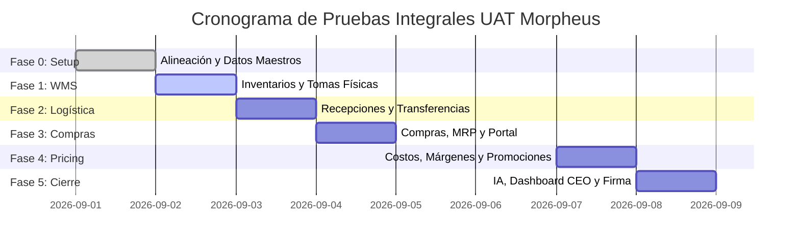

# 🗓️ Plan de Trabajo: Pruebas Integrales de Aceptación (UAT)
## Proyecto Morpheus ERP / WMS

**Versión:** 1.0  
**Audiencia:** Equipo de Proyecto Cliente (Líderes de Área, Operaciones, Compras, Finanzas) y Equipo de Implementación Morpheus  
**Documento Base de Casos:** [`docs/protocolo_pruebas_integrales_uat_cliente.md`](file:///home/lzambrano/Desarrollo/Morpheus/docs/protocolo_pruebas_integrales_uat_cliente.md)

---

## 🎯 1. Objetivo General
Garantizar la correcta operación, integridad de datos y adopción de los flujos de negocio de **Morpheus ERP** mediante la ejecución guiada de pruebas integrales de extremo a extremo (*End-to-End*) junto a los usuarios clave (*Key Users*) del cliente, previo a la salida en vivo (*Go-Live*).

---

## 👥 2. Matriz de Roles y Participantes (RACI)

| Rol en UAT | Responsable Sugerido (Cliente / Morpheus) | Función Principal |
| :--- | :--- | :--- |
| **Sponsor / Líder de Proyecto Cliente** | Gerencia General / Operaciones | Validar cumplimiento de objetivos de negocio y firmar acta de aceptación. |
| **Key User - Inventarios & WMS** | Jefe de Almacén / Auditor de Inventarios | Ejecutar pruebas de tomas físicas, ajustes, lotes y transferencias. |
| **Key User - Compras & Abastecimiento** | Jefe / Analistas de Compras | Validar sugeridos MRP, órdenes de compra, portal y 3-way match. |
| **Key User - Costos & Pricing** | Gerente de Administración / Finanzas | Validar recálculo de costos promedio y sesiones de precios. |
| **Líder Técnico Morpheus** | Lindbergh Zambrano / Equipo Dev | Facilitar las sesiones, guiar la ejecución, resolver dudas y atender incidencias técnicas. |

---

## 📅 3. Cronograma de Ejecución por Fases (Plan de 5 Sesiones)

---

### 🔹 DÍA 0: Preparación y Validación de Ambiente (Pre-UAT)
* **Duración:** 2 Horas
* **Participantes:** Líder Técnico Morpheus + Líder de Proyecto Cliente
* **Objetivos:**
  1. Verificar disponibilidad de ambientes QA/Staging ([Hub 4000](http://localhost:4000), [Inventory 4001](http://localhost:4001), [Purchases 4002](http://localhost:4002), [WMS 4003](http://localhost:4003), [Pricing 4004](http://localhost:4004)).
  2. Verificar carga de datos maestros base (Catálogo de productos, Sucursales reales, Proveedores y Usuarios con roles RBAC).
  3. Entrega de credenciales de acceso a los Key Users.

---

### 🔹 DÍA 1 (Sesión 1): Inventarios, Almacenes y Tomas Físicas
* **Módulo:** WMS & Neo Inventario
* **Casos del Protocolo:** `UAT-INV-01`, `UAT-INV-02`, `UAT-INV-03`, `UAT-INV-04`
* **Flujo a Validar:**
  1. **Stock Operativo:** Auditoría y verificación de existencias sincronizadas del POS en el Almacén Principal pre-configurado.
  2. **Toma Física en 3 Fases:**
     - Fase 1: Conteo Ciego del auditor.
     - Fase 2: Comparativa de discrepancias + Diagnóstico del Asistente IA.
     - Fase 3: Consolidación y generación automática de ajustes de Kardex.
  3. **Trazabilidad:** Bloqueo y despacho de Lotes en Cuarentena / Fechas de Vencimiento.
  4. **Seguridad:** Aprobación de cargos/descargos con permisos RBAC.

---

### 🔹 DÍA 2 (Sesión 2): Logística, Recepciones en Muelle y Transferencias
* **Módulo:** WMS & Logística
* **Casos del Protocolo:** `UAT-LOG-01`, `UAT-LOG-02`, `UAT-LOG-03`
* **Flujo a Validar:**
  1. **Recepción en Muelle (Dock Staging):** Recepción física de mercancía contra Orden de Compra y pase a inventario disponible.
  2. **Transferencias Inter-Sucursales:** Solicitud de traslado desde Almacén Central a Sucursal destino (descuento e incremento simultáneo).
  3. **Identificación Física:** Generación e impresión de etiquetas con código de barras (EAN-13 y Ubicaciones).

---

### 🔹 DÍA 3 (Sesión 3): Compras, Motor MRP y Portal de Proveedores
* **Módulo:** Neo Compras
* **Casos del Protocolo:** `UAT-COM-01`, `UAT-COM-02`, `UAT-COM-03`, `UAT-COM-04`
* **Flujo a Validar:**
  1. **Sugeridos de Reposición (MRP):** Revisión de propuestas automáticas por histórico de ventas y rotación.
  2. **Emisión de Órdenes de Compra:** Configuración bimonetaria (USD/Bs) y descuentos encadenados (`10+5%`).
  3. **Portal Proveedor:** Envío de enlace seguro por token público y aceptación/confirmación por parte del proveedor sin login.
  4. **Conciliación 3-Way Match:** Cuadro de Orden de Compra vs Recepción de Muelle vs Factura del Proveedor.

---

### 🔹 DÍA 4 (Sesión 4): Costos, Motor de Precios y Promociones
* **Módulo:** Neo Pricing & Finanzas
* **Casos del Protocolo:** `UAT-COS-01`, `UAT-COS-02`, `UAT-COS-03`
* **Flujo a Validar:**
  1. **Costo Promedio Ponderado:** Validación de la fórmula tras recibir compras a costo variable.
  2. **Sesión Masiva de Precios:** Simulación y aplicación de nuevos PVP por sucursal según margen de utilidad objetivo (ej. 30%).
  3. **Campañas Promocionales:** Creación de promociones temporales con fecha de vigencia automática.

---

### 🔹 DÍA 5 (Sesión 5): Inteligencia Artificial, Dashboards Ejecutivos y Cierre
* **Módulo:** IA Core & Tableros Gerenciales
* **Casos del Protocolo:** `UAT-IA-01`, `UAT-IA-02`, `UAT-IA-03` + Hoja de Firmas
* **Flujo a Validar:**
  1. **Asistente IA Conversacional:** Consultas en lenguaje natural (*"¿Cuáles son los productos con menor stock?"*, *"¿Qué órdenes están en tránsito?"*).
  2. **Dashboard CEO:** KPIs de valoración total, días de inventario y rotación por tienda.
  3. **Sesión de Cierre:** Revisión de la bitácora de incidencias, firma del acta de aceptación y definición de fecha de Go-Live.

---

## 🚦 4. Clasificación y Tratamiento de Incidencias

Toda observación detectada durante las sesiones se registrará con la siguiente severidad:

| Severidad | Criterio | Tiempo de Respuesta (SLA) |
| :--- | :--- | :--- |
| 🔴 **Bloqueante (Critica)** | Impide continuar el flujo operativo o corrompe datos. | Corrección en < 24h (Mismo día). |
| 🟡 **Mayor (Media)** | El flujo continúa pero requiere un paso alterno o validación manual. | Corrección en 24-48h. |
| 🟢 **Menor / Mejora (Baja)** | Detalle cosmético, texto de ayuda o ajuste menor de UI. | Se incorpora en la siguiente iteración. |

---

## 📊 5. Criterios de Aprobación para Salida en Vivo (Go / No-Go)

Para declarar el UAT como **Aprobado con Éxito**, se deben cumplir las siguientes condiciones:
* ✅ **100%** de los casos críticos del protocolo ejecutados.
* ✅ **0** incidencias abiertas de severidad 🔴 Bloqueante.
* ✅ **100%** de los Key Users capacitados y con sus flujos validados en el sistema.
* ✅ **Firma del Acta de Aceptación** por parte de los líderes de proyecto.
