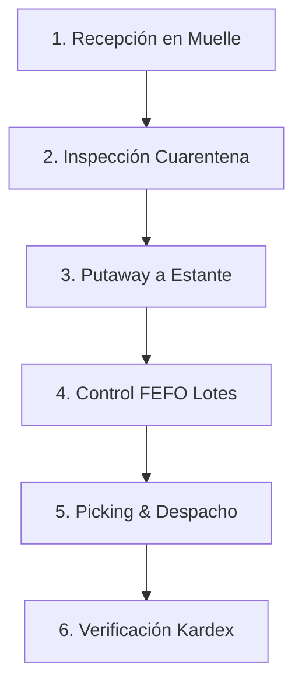

# Plan de Pruebas y Certificación: Módulo Logística & WMS (`NEO Warehouse`)

Este documento define la **Matriz de Casos de Prueba Funcionales, Integrados (E2E) y Criterios de Aceptación (UAT)** para certificar al **100%** el módulo logístico **NEO Warehouse**, estructurado formalmente según las opciones del menú de navegación del sistema.

---

## 1. Matriz de Pruebas por Opción de Menú

```
┌─────────────────────────────────────────────────────────────────────────┐
│                      NEO WAREHOUSE - TEST MATRIX                        │
├───────────────────────────────────┬─────────────────────────────────────┤
│ Operaciones Logísticas            │ Configuración & Auditoría           │
│ ├─ 1. Dashboard Muelle            │ ├─ 5. Control de Lotes (FEFO)       │
│ ├─ 2. Recepción (Inbound)         │ └─ 6. Ajustes Físicos               │
│ ├─ 3. Despachos & Picking         │                                     │
│ ├─ 4. Mapa de Almacén             │                                     │
│ └─ 5. Asistente IA                │                                     │
└───────────────────────────────────┴─────────────────────────────────────┘
```

---

### 🏠 1. Dashboard Muelle (`/`)
**Objetivo:** Verificar la integridad de los accesos directos, tarjetas operativas y resúmenes de inventario en tiempo real.

| ID Caso | Descripción del Caso | Pasos de Ejecución | Resultado Esperado | Criterio de Éxito |
| :--- | :--- | :--- | :--- | :---: |
| `TC-DASH-01` | Carga de Tarjetas de Acceso | Acceder a la ruta `/` | Se despliegan las tarjetas principales (Muelle, Mapa, Lotes, Ajustes). | PASS |
| `TC-DASH-02` | Navegación por Clic | Hacer clic en la tarjeta "Muelle de Recepción" | Redirección inmediata a `/receipts`. | PASS |
| `TC-DASH-03` | Resumen de Ocupación | Revisar los indicadores de métricas | Muestra el total de camiones pendientes por recibir. | PASS |

---

### 🚚 2. Recepción - Inbound (`/receipts`)
**Objetivo:** Garantizar el ingreso correcto de mercancías provenientes de Órdenes de Compra y Recepciones Directas.

| ID Caso | Descripción del Caso | Pasos de Ejecución | Resultado Esperado | Criterio de Éxito |
| :--- | :--- | :--- | :--- | :---: |
| `TC-INB-01` | Filtros de Muelle | Seleccionar Sucursal y Proveedor | Filtra dinámicamente las O/C correspondientes al muelle. | PASS |
| `TC-INB-02` | Recepción con Lote | Ingresar a una O/C, colocar Lote y Fecha de Vencimiento | Registra la entrada y genera el registro en `batches`. | PASS |
| `TC-INB-03` | Recepción Parcial | Recibir solo el 50% de la cantidad pedida | La orden cambia a estado `partial` (Backorder activo). | PASS |
| `TC-INB-04` | Recepción Directa | Hacer clic en "Recepción Directa (Sin ODC)", llenar renglones y guardar | Crea la recepción `REC-DIR-...` y suma al stock. | PASS |
| `TC-INB-05` | **Rechazo en Puerta (Devolución)** | Marcar devolución al chofer por daño/avería en muelle | Registra el rechazo, refleja la devolución en el Acta 80mm y NO suma al stock. | PASS |
| `TC-INB-06` | **Retención / Bloqueo de Lote** | Bloquear lote en `/lots` para inspección técnica | Cambia el estado a retenido impidiendo su picking/despacho. | PASS |

---

### 📦 3. Despachos & Transferencias Outbound (`/shipments` / `/transfers`)
**Objetivo:** Verificar la preparación de pedidos de venta B2B, olas de picking y reubicación interna (Putaway).

| ID Caso | Descripción del Caso | Pasos de Ejecución | Resultado Esperado | Criterio de Éxito |
| :--- | :--- | :--- | :--- | :---: |
| `TC-OUT-01` | Crear Orden de Salida | Hacer clic en "Nueva Orden de Salida", seleccionar cliente y variante | Se crea la orden `OUT-YYYYMMDD...` en estado `READY`. | PASS |
| `TC-OUT-02` | **Olas de Picking** | Cambiar a pestaña "Olas de Picking por Ubicación" | Muestra las tarjetas agrupadas por código de estante/pasillo. | PASS |
| `TC-OUT-03` | Confirmar Salida Física| Hacer clic en "Confirmar Salida" en la orden de despacho | Pasa a estado `DONE` y descuenta del `InventorySnapshot`. | PASS |
| `TC-OUT-04` | Movimiento Putaway | En `/locations` o `/transfers`, reubicar mercancía de muelle a estante | Mueve el stock de la ubicación origen a la ubicación destino. | PASS |

---

### 🗺️ 4. Mapa de Almacén (`/locations`)
**Objetivo:** Evaluar la jerarquía de almacenamiento, bloqueo de pasillos y mapa térmico de ocupación volumétrica.

| ID Caso | Descripción del Caso | Pasos de Ejecución | Resultado Esperado | Criterio de Éxito |
| :--- | :--- | :--- | :--- | :---: |
| `TC-LOC-01` | Árbol de Almacenes | Cargar la pantalla `/locations` | Muestra la estructura Almacén > Zona > Estante. | PASS |
| `TC-LOC-02` | **Mapa Térmico** | Observar la columna de Saturación Volumétrica | Muestra la barra de % de llenado y etiqueta (`DESPEJADO`, `OCUPADO`, `SATURADO`). | PASS |
| `TC-LOC-03` | Bloqueo de Ubicación | Cambiar estado de ubicación a bloqueada | Impide seleccionar dicha ubicación para recepciones o salidas. | PASS |

---

### 🗓️ 5. Control de Lotes & FEFO (`/lots`)
**Objetivo:** Certificar la trazabilidad por número de lote y la sugerencia de salida por vencimiento (First Expired, First Out).

| ID Caso | Descripción del Caso | Pasos de Ejecución | Resultado Esperado | Criterio de Éxito |
| :--- | :--- | :--- | :--- | :---: |
| `TC-LOT-01` | Búsqueda de Lote | Escribir número de lote en la barra de búsqueda | Filtra inmediatamente el lote correspondiente. | PASS |
| `TC-LOT-02` | **Sugerencia FEFO** | Observar la tabla de lotes de un mismo producto | El lote que vence primero exhibe el badge verde **"FEFO RECOMENDADO"**. | PASS |
| `TC-LOT-03` | Semáforo Vencimiento | Probar con un lote a vencer en 15 días | Muestra el estado `POR VENCER (< 30 DÍAS)` en color amarillo. | PASS |

---

### ⚖️ 6. Ajustes Físicos & Mermas (`/adjustments`)
**Objetivo:** Validar la corrección de faltantes/sobrantes y el registro de mermas por rotura/daño.

| ID Caso | Descripción del Caso | Pasos de Ejecución | Resultado Esperado | Criterio de Éxito |
| :--- | :--- | :--- | :--- | :---: |
| `TC-ADJ-01` | Ajuste por Faltante | Seleccionar ubicación, producto y cantidad a ajustar (-) | Genera el movimiento de ajuste y descuenta del saldo. | PASS |
| `TC-ADJ-02` | Registro de Merma | Registrar mercancía rota seleccionando motivo "DAÑADO" | Afecta el inventario de merma y queda registrado en Kardex. | PASS |

---

### 🤖 7. Asistente IA Logístico (`/asistente-ia`)
**Objetivo:** Probar la interacción por lenguaje natural para consultas de stock y recomendaciones de espacio.

| ID Caso | Descripción del Caso | Pasos de Ejecución | Resultado Esperado | Criterio de Éxito |
| :--- | :--- | :--- | :--- | :---: |
| `TC-AI-01` | Consulta de Stock | Escribir "¿Dónde está ubicado el SKU 1002?" | El asistente responde con la ubicación y saldo disponible. | PASS |

---

## 2. Protocolo de Ejecución del Escenario Integrado (Prueba E2E)

Para certificar el módulo al **100% en Producción/Staging**, el usuario evaluador debe seguir esta secuencia continua:



1. **Entrada:** Recibir 100 unidades del producto en `Recepción (Inbound)` registrando lote `LOT-TEST-01` con vencimiento a 6 meses.
2. **Inspección:** Simular 5 unidades dañadas, verificando que pasen a `Cuarentena` y liberando las 95 restantes.
3. **Ubicación:** Ejecutar `Putaway` moviendo las 95 unidades del muelle al estante `STOCK-A1`.
4. **Validación Volumétrica:** Verificar en `Mapa de Almacén` que la barra térmica del estante `STOCK-A1` incremente su % de ocupación.
5. **Salida:** En `Despachos & Picking`, crear una orden por 20 unidades, verificar la sugerencia FEFO y confirmar el despacho.
6. **Cierre:** Verificar que el saldo final en `Control de Lotes` refleje exactamente 75 unidades disponibles.
