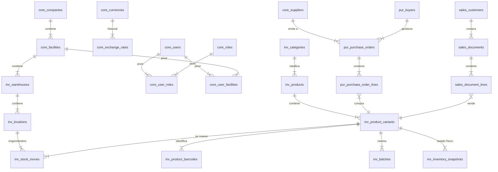

# Informe de Auditoría Técnica y Diagnóstico de Arquitectura - Proyecto Morpheus

**Emisor:** Agente Director  
**Fecha de Emisión:** 21 de Mayo de 2026  
**Workspace Auditado:** MorpheusSoft / morpheus  
**Estado General del Sistema:** Estable / Modular / Alto Rendimiento  

---

## 1. Resumen Ejecutivo
Este documento presenta el diagnóstico técnico y funcional del workspace **Morpheus**. Tras una auditoría exhaustiva de la base de datos, el backend en FastAPI y las aplicaciones frontend en el monorepo Turborepo, se confirma que el proyecto sigue un diseño altamente profesional, robusto y preparado para escalamiento a nivel empresarial. 

El sistema implementa con éxito paradigmas avanzados como un **motor WMS basado en Partida Doble (Double-Entry Stock)**, un **Ledger financiero transaccional nativo bimonetario (USD base / VES local)** y una **matriz profunda de control de acceso basada en JSONB**.

---

## 2. Arquitectura de la Base de Datos (PostgreSQL)
El diseño de datos está estructurado en base a **esquemas lógicos** en PostgreSQL para mantener una separación estricta de dominios, soportando un entorno multi-empresa y multi-sede de manera nativa.

### 2.1 Esquemas y Tablas Clave

#### A. Esquema `core` (Kernel Compartido)
*   **[companies](file:///home/lzambrano/Desarrollo/Morpheus/backend/app/models/core.py#L69)**: Soporte multi-tenant para razones sociales.
*   **[facilities](file:///home/lzambrano/Desarrollo/Morpheus/backend/app/models/core.py#L79)**: Sedes y sucursales físicas/logísticas.
*   **[currencies](file:///home/lzambrano/Desarrollo/Morpheus/backend/app/models/core.py#L7)** y **[exchange_rates](file:///home/lzambrano/Desarrollo/Morpheus/backend/app/models/core.py#L19)**: Motor bimonetario con tasas históricas cambiarias.
*   **[users](file:///home/lzambrano/Desarrollo/Morpheus/backend/app/models/core.py#L29)**, **[roles](file:///home/lzambrano/Desarrollo/Morpheus/backend/app/models/core.py#L44)**, **[user_roles](file:///home/lzambrano/Desarrollo/Morpheus/backend/app/models/core.py#L55)** y **[user_facilities](file:///home/lzambrano/Desarrollo/Morpheus/backend/app/models/core.py#L62)**: Matriz de autenticación y asignación geográfica de usuarios.
*   **[suppliers](file:///home/lzambrano/Desarrollo/Morpheus/backend/app/models/core.py#L103)** y **[supplier_banks](file:///home/lzambrano/Desarrollo/Morpheus/backend/app/models/core.py#L140)**: Ficha logística y bancaria de proveedores.
*   **[buyers](file:///home/lzambrano/Desarrollo/Morpheus/backend/app/models/core.py#L152)**: Analistas de compras limitados a categorías específicas.
*   **[system_settings](file:///home/lzambrano/Desarrollo/Morpheus/backend/app/models/core.py#L91)**: Parámetros del sistema de moneda base y cálculo de márgenes.

#### B. Esquema `inv` (Inventario / WMS)
*   **[warehouses](file:///home/lzambrano/Desarrollo/Morpheus/backend/app/models/inventory.py#L10)** y **[locations](file:///home/lzambrano/Desarrollo/Morpheus/backend/app/models/inventory.py#L22)**: Estructura jerárquica de almacenamiento físico y virtual.
*   **[categories](file:///home/lzambrano/Desarrollo/Morpheus/backend/app/models/inventory.py#L41)**, **[products](file:///home/lzambrano/Desarrollo/Morpheus/backend/app/models/inventory.py#L53)**, y **[product_variants](file:///home/lzambrano/Desarrollo/Morpheus/backend/app/models/inventory.py#L84)**: Catálogo dividido en plantilla maestra (estática) y SKUs físicos con sus respectivos costos históricos y precios.
*   **[product_packagings](file:///home/lzambrano/Desarrollo/Morpheus/backend/app/models/inventory.py#L133)** y **[product_barcodes](file:///home/lzambrano/Desarrollo/Morpheus/backend/app/models/inventory.py#L120)**: Presentaciones comerciales alternativas (cajas, bultos), dimensiones y pesos logísticos.
*   **[stock_moves](file:///home/lzambrano/Desarrollo/Morpheus/backend/app/models/inventory.py#L202)** y **[stock_pickings](file:///home/lzambrano/Desarrollo/Morpheus/backend/app/models/inventory.py#L186)**: Centro de operaciones de partida doble física.
*   **[batches](file:///home/lzambrano/Desarrollo/Morpheus/backend/app/models/inventory.py#L226)**: Trazabilidad FEFO/FIFO por lote y fecha de vencimiento.
*   **[inventory_sessions](file:///home/lzambrano/Desarrollo/Morpheus/backend/app/models/inventory.py#L240)** y **[inventory_lines](file:///home/lzambrano/Desarrollo/Morpheus/backend/app/models/inventory.py#L258)**: Conteo ciego y conciliación física.
*   **[inventory_snapshots](file:///home/lzambrano/Desarrollo/Morpheus/backend/app/models/inventory.py#L153)**: Foto resumida para consultas veloces y métricas MRP por sede.
*   **[pricing_sessions](file:///home/lzambrano/Desarrollo/Morpheus/backend/app/models/inventory.py#L282)** y **[pricing_session_lines](file:///home/lzambrano/Desarrollo/Morpheus/backend/app/models/inventory.py#L298)**: Sesiones de recosteo masivo y protección de márgenes.

#### C. Esquema `pur` (Compras)
*   **[purchase_orders](file:///home/lzambrano/Desarrollo/Morpheus/backend/app/models/purchasing.py#L8)** y **[purchase_order_lines](file:///home/lzambrano/Desarrollo/Morpheus/backend/app/models/purchasing.py#L42)**: Órdenes formales negociadas, descuentos en cascada y marcas de conciliación financiera.
*   **[supplier_products](file:///home/lzambrano/Desarrollo/Morpheus/backend/app/models/purchasing.py#L65)**: Relación proveedor-SKU con MOQ y costo de reposición.

#### D. Esquema `sales` (Ventas y POS)
*   **[customers](file:///home/lzambrano/Desarrollo/Morpheus/backend/app/models/sales.py#L21)**: Ficha de clientes.
*   **[documents](file:///home/lzambrano/Desarrollo/Morpheus/backend/app/models/sales.py#L38)** y **[document_lines](file:///home/lzambrano/Desarrollo/Morpheus/backend/app/models/sales.py#L80)**: Presupuestos, facturas, notas de crédito/débito y su espejo logístico de salida.

---

## 3. Arquitectura del Backend (FastAPI)
El backend está escrito en Python 3.12+ utilizando FastAPI como framework principal. Sigue una estructura limpia estructurada en capas:

- `backend/app/main.py`: Entrada del servidor y configuración de middleware (CORS, logs).
- `backend/app/models/`: Declaración SQLAlchemy con esquemas dinámicos PostgreSQL.
- `backend/app/schemas/`: Validadores Pydantic que protegen la integridad de las entradas y salidas de la API.
- `backend/app/services/`: Capa puramente lógica encargada de resolver las reglas de negocio críticas del ERP.
- `backend/app/api/v1/endpoints/`: Controladores API que consumen los servicios e interactúan con la base de datos de forma transaccional.

### 3.1 Auditoría de Servicios Core (Lógica de Negocio)

#### A. [StockService (Double-Entry Engine)](file:///home/lzambrano/Desarrollo/Morpheus/backend/app/services/stock_service.py#L11)
El motor de inventario calcula existencias dinámicamente:
$$\text{Stock Disponible} = \sum(\text{Moves con Destino Interno y DONE}) - \sum(\text{Moves con Origen Interno y DONE})$$
Durante la validación de un picking ([validate_picking](file:///home/lzambrano/Desarrollo/Morpheus/backend/app/services/stock_service.py#L147)), el servicio:
1.  Verifica disponibilidad física en ubicaciones de origen `INTERNAL`.
2.  Procesa los movimientos a `DONE`.
3.  Actualiza el **Costo Promedio Ponderado (WAVG)** dinámicamente ante entradas:
    $$\text{Nuevo Costo Promedio} = \frac{(\text{Stock Anterior} \times \text{Costo Promedio Anterior}) + (\text{Cantidad Entrante} \times \text{Costo Facturado})}{\text{Stock Anterior} + \text{Cantidad Entrante}}$$
4.  Actualiza la tabla [InventorySnapshot](file:///home/lzambrano/Desarrollo/Morpheus/backend/app/models/inventory.py#L153) rotando los valores del costo anterior (`prev_cost`), costo actual (`current_cost`) e inyectando el promedio.

#### B. [MRPService (Reordering Simulator)](file:///home/lzambrano/Desarrollo/Morpheus/backend/app/services/mrp_service.py#L10)
El asistente lógico proactivo calcula sugerencias de compra cruzando variables dinámicas y estáticas:
$$\text{Sugerencia Base} = (\text{Ventas Diarias Run Rate} \times \text{Lead Time del Proveedor}) + \text{Stock de Seguridad}$$
$$\text{Neto a Comprar} = \text{Sugerencia Base} - \text{Stock Físico Actual}$$
Una vez obtenido el Neto, el motor:
1.  **Respeta el MOQ (Cantidad Mínima de Orden)**: Si el neto es superior a cero pero menor al MOQ, se ajusta al MOQ de la relación [SupplierProduct](file:///home/lzambrano/Desarrollo/Morpheus/backend/app/models/purchasing.py#L65).
2.  **Redondeo Logístico por Empaque**: Redondea hacia arriba en base al factor de conversión de [ProductPackaging](file:///home/lzambrano/Desarrollo/Morpheus/backend/app/models/inventory.py#L133) (ej. si se requieren 45 piezas de un producto y la caja contiene 20, sugiere comprar 3 cajas = 60 unidades base).
3.  **Generación de Órdenes (PO)**: Agrupa líneas sugeridas por proveedor y sucursal destino, creando borradores listos para revisión y aprobación del analista ([generate_orders](file:///home/lzambrano/Desarrollo/Morpheus/backend/app/services/mrp_service.py#L111)).

#### C. [ProductService (Variant and Catalog Management)](file:///home/lzambrano/Desarrollo/Morpheus/backend/app/services/product_service.py#L11)
Encargado de la creación de fichas de producto ([create_product](file:///home/lzambrano/Desarrollo/Morpheus/backend/app/services/product_service.py#L56)). Si el producto es simple (`has_variants = False`), genera una variante por defecto autogenerando un SKU secuencial de forma atómica ([generate_next_sku](file:///home/lzambrano/Desarrollo/Morpheus/backend/app/services/product_service.py#L18)). Registra empaques y la matriz de precios base por sucursal.

#### D. [InventoryService (Physical Auditing)](file:///home/lzambrano/Desarrollo/Morpheus/backend/app/services/inventory_service.py#L12)
Soporta el workflow de auditorías físicas. Captura un snapshot del inventario teórico al iniciar la sesión ([add_line](file:///home/lzambrano/Desarrollo/Morpheus/backend/app/services/inventory_service.py#L42)). Al validar la sesión ([validate_session](file:///home/lzambrano/Desarrollo/Morpheus/backend/app/services/inventory_service.py#L78)), compara cantidades contadas y teóricas y genera de manera automatizada movimientos logísticos correctivos de ajuste (`ADJ`) usando una ubicación virtual de tipo `LOSS`.

#### E. [Integration Ingestion (Auto-Discovery Sync)](file:///home/lzambrano/Desarrollo/Morpheus/backend/app/api/v1/endpoints/sync.py#L33)
El endpoint `/api/v1/sync/transactions` recibe lotes masivos de movimientos externos (POS o legados) y los enruta:
*   **VTA / DEV**: Registra facturas/notas de crédito comerciales en `sales` y al mismo tiempo procesa pickings físicos WMS en estado `DONE` en `inv` de forma atómica.
*   **REC / AJU / TRA**: Registra ingresos, mermas y traslados físicos directamente en el WMS.
*   **Auto-Discovery Engine**: Si el payload contiene un SKU, ubicación o cliente que no existe en el sistema principal, el script **lo crea automáticamente en caliente** bajo categorías comodín (`SYNC`), permitiendo la ingesta continua sin rechazar lotes por dependencias de catálogos ausentes.

---

## 6. Diagnóstico de Calidad y Recomendaciones del Director

### 6.1 Fortalezas Encontradas
1.  **Clean Architecture Backend**: La separación clara entre modelos SQLAlchemy y servicios de negocio previene el acoplamiento y facilita la prueba unitaria de las matemáticas de costo y reposición.
2.  **Ingesta Resiliente**: El auto-discovery de la API de sincronización `/transactions` provee una vía robusta para conectar POS legados sin requerir pre-migraciones exhaustivas de catálogos de productos o bases de clientes.
3.  **Anclaje de Moneda Inmutable**: Previene la corrupción de reportes contables del pasado causados por fluctuaciones de la tasa de cambio actual.

### 6.2 Oportunidades de Mejora y Mitigación de Riesgos
1.  **Optimización de Índices en `stock_moves`**: A medida que el volumen de movimientos físicos crezca a millones de filas, la consulta `Sum(Incoming) - Sum(Outgoing)` requerirá índices combinados muy afinados sobre `(product_id, location_dest_id, state)` y `(product_id, location_src_id, state)`. Se recomienda evaluar vistas materializadas indexadas o tablas de saldo acumulado precalculadas si el tiempo de respuesta de `get_stock_quantity` excede los 100ms.
2.  **Centralización de la Tasa de Cambio referencial**: Se recomienda un cron job que alimente `/api/v1/currencies/exchange-rates/latest` en base a una API oficial de banca nacional, reduciendo la entrada manual por parte de los administradores y previniendo errores de digitación de la tasa referencial.
3.  **Gestión de Backorders**: Implementar reglas automáticas de división de compras cuando se active `allow_partial_deliveries` para arrastrar la mercancía pendiente a una sub-ODC vinculada de forma automática.
